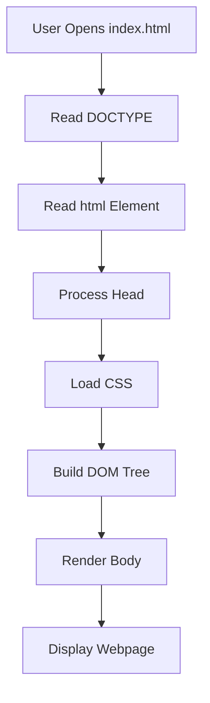
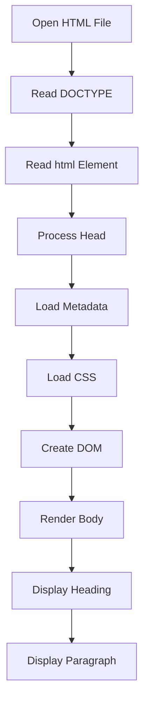

| | [🏠 HTML5 Index](README.md) | [Text Formatting ➔](02-Text-Formatting.md) |
---

# 📖 Module 1: HTML Fundamentals

<details open>
<summary><b>📋 What You'll Learn</b></summary>

- Understand the **HTML5 boilerplate** and the purpose of every tag
- Learn how the **browser rendering process** works step-by-step
- Master **meta tags**, **character encoding**, and **favicon** setup
- Explore the **DOM (Document Object Model)** tree structure
- Understand **HTML5 Web Storage** (localStorage & sessionStorage)
- Learn the **viewport meta tag** for responsive design
- Practice with **4 interactive quiz questions**

</details>

---

## 🌐 What is HTML?

HTML stands for **HyperText Markup Language**.

It is the standard markup language used to create webpages.

HTML **does not perform calculations or make decisions** like programming languages. Instead, it tells the browser **what content exists and how it is structured**.

Think of a website like a human body:

```text
Human Body          Website
──────────          ───────
Skeleton      →     HTML       (Structure)
Muscles       →     CSS        (Styling)
Skin          →     JavaScript (Functionality)
```

- **HTML** → Structure
- **CSS** → Styling
- **JavaScript** → Functionality

---

## 📌 HTML5 Boilerplate

```html
<!DOCTYPE html>
<html lang="en">
<head>
    <meta charset="UTF-8">
    <meta name="author" content="Jyoti">
    <meta name="description" content="This page contains all the things I am learning how to create as I learn HTML.">
    <meta name="viewport" content="width=device-width, initial-scale=1.0">
    <title>My First Web Page</title>
    <link rel="icon" href="202.jpg" type="image/x-icon">
    <link rel="stylesheet" href="main.css">
</head>

<body>
    <h1>Welcome to My First Web Page</h1>
    <p>This is a simple web page</p>
</body>

</html>
```

> [!TIP]
> In VS Code, type `!` and press `Tab` to instantly generate the HTML5 boilerplate.

---

## 🧠 Browser Rendering Process

When the browser opens an HTML file, it follows these steps:



> [!NOTE]
> The browser **blocks rendering** while loading CSS. This is why CSS files should be optimized and kept small — they directly impact how fast the page appears.

---

## 📖 HTML Document Structure

```text
html
│
├── head
│     ├── meta (charset)
│     ├── meta (author)
│     ├── meta (description)
│     ├── meta (viewport)
│     ├── title
│     ├── link (favicon)
│     └── link (stylesheet)
│
└── body
      ├── h1
      └── p
```

Everything inside the webpage is contained within the `<html>` element.

---

## 1️⃣ `<!DOCTYPE html>`

```html
<!DOCTYPE html>
```

### Purpose

Declares that the document follows the **HTML5 standard**.

Without it, browsers may switch to **Quirks Mode**, causing inconsistent rendering.

> [!WARNING]
> **Quirks Mode** makes the browser emulate old, non-standard behavior from the IE5/Netscape era. This can break modern CSS layouts like Flexbox and Grid. Always include the DOCTYPE.

### Browser Action

```text
Reads DOCTYPE
        ↓
Uses HTML5 Rendering Mode
```

---

## 2️⃣ `<html lang="en">`

```html
<html lang="en">
```

This is the **root element** of every HTML document.

Everything visible and invisible on the webpage exists inside this tag.

### `lang="en"`

Specifies that the document language is English.

#### Benefits

- Better SEO
- Better accessibility
- Better translation support
- Screen readers pronounce words correctly

> [!TIP]
> For multilingual sites, you can set `lang` on individual elements too:
> ```html
> <p lang="fr">Bonjour le monde</p>
> ```

---

## 3️⃣ `<head>`

```html
<head>
```

The `<head>` section contains information **about the webpage**, not the visible page content.

It stores:

- Metadata
- Page title
- CSS files
- Icons
- Scripts (often)
- Fonts
- SEO information

---

## 4️⃣ Character Encoding

```html
<meta charset="UTF-8">
```

### Purpose

Specifies how text characters are encoded.

UTF-8 supports nearly every language and symbol.

Examples:

```text
English  → Hello
Hindi    → नमस्ते
Japanese → こんにちは
Emoji    → 😀🔥❤️
```

> [!WARNING]
> Without UTF-8, characters may display as `�` or garbled text. Always place `<meta charset="UTF-8">` as the **first element** inside `<head>`.

---

## 5️⃣ Author Meta Tag

```html
<meta name="author" content="Jyoti">
```

Provides metadata about the author.

This information is **not displayed** on the webpage but can be read by browsers, developer tools, and search engines.

---

## 6️⃣ Description Meta Tag

```html
<meta name="description" content="This page contains all the things I am learning...">
```

### Purpose

Describes the webpage.

Search engines may use this text as the page description in search results.

Example:

```text
Google Search Result

My First Web Page
This page contains everything I am learning while studying HTML.
```

### Benefits

- Better SEO
- Better click-through rate
- Helps search engines understand page content

> [!TIP]
> Keep meta descriptions between **50–160 characters** for optimal display in search results. Too short and it's not useful; too long and it gets truncated.

---

## 7️⃣ Viewport Meta Tag

```html
<meta name="viewport" content="width=device-width, initial-scale=1.0">
```

### Purpose

Controls how the page is displayed on mobile devices.

Without it, mobile browsers render the page at a desktop width and then shrink it down, making text unreadable.

| Attribute | Meaning |
| :--- | :--- |
| `width=device-width` | Sets the viewport width to match the device screen |
| `initial-scale=1.0` | Sets the initial zoom level to 100% |

> [!IMPORTANT]
> This tag is **essential for responsive design**. Without it, media queries and responsive CSS will not work correctly on mobile devices.

---

## 8️⃣ `http-equiv="X-UA-Compatible"`

```html
<meta http-equiv="X-UA-Compatible" content="IE=edge">
```

### Purpose

Tells **Internet Explorer** to use its latest rendering engine instead of falling back to an older compatibility mode.

| Value | Meaning |
| :--- | :--- |
| `IE=edge` | Always use the highest available IE rendering mode |

> [!NOTE]
> This tag is a **legacy tag** — modern browsers (Chrome, Firefox, Edge, Safari) ignore it entirely. It was only relevant for IE8–IE11. You may still see it in older codebases or generated boilerplates, but it is **not needed** for modern web development.

---

## 9️⃣ `<title>`

```html
<title>My First Web Page</title>
```

Defines the page title.

Visible in:

- Browser tab
- Browser history
- Bookmarks
- Search engine results

```text
Chrome
📄 My First Web Page
```

---

## 🔟 Favicon

```html
<link rel="icon" href="202.jpg" type="image/x-icon">
```

A favicon is the small icon displayed beside the page title in the browser tab.

### Attributes

| Attribute | Meaning |
| :--- | :--- |
| `rel` | Relationship to the document |
| `href` | Location of the icon |
| `type` | MIME type of the file |

> [!WARNING]
> Since the file is `202.jpg`, the correct MIME type should be `image/jpeg`, not `image/x-icon`. Use `image/x-icon` only for `.ico` files:
> ```html
> <link rel="icon" href="202.jpg" type="image/jpeg">
> ```

---

## 1️⃣1️⃣ External CSS

```html
<link rel="stylesheet" href="main.css">
```

Connects the HTML page to an external CSS file.

Browser process:

```text
Read HTML → Find CSS → Download CSS → Parse CSS → Apply Styles → Render Page
```

Keeping CSS in a separate file improves maintainability and reuse.

---

## 1️⃣2️⃣ `<body>`

```html
<body>
```

Contains everything that is visible on the webpage.

Examples:

- Text
- Images
- Buttons
- Forms
- Videos
- Tables
- Lists

---

## 1️⃣3️⃣ Heading

```html
<h1>Welcome to My First Web Page</h1>
```

The `<h1>` element represents the **main heading** of the page.

Heading hierarchy:

```text
h1  ← Main heading (one per page)
 └── h2
      └── h3
           └── h4
                └── h5
                     └── h6
```

> [!IMPORTANT]
> Use **one `<h1>` per page** to represent the primary topic. Never skip heading levels (e.g., jumping from `<h2>` to `<h5>`). Search engines use heading hierarchy to understand page structure.

---

## 1️⃣4️⃣ Paragraph

```html
<p>This is a simple web page</p>
```

Defines a paragraph of text.

Browsers automatically add spacing around paragraphs.

---

## 🌳 DOM (Document Object Model)

After parsing the HTML, the browser creates a DOM tree.

```text
Document
│
└── html
      │
      ├── head
      │     ├── meta
      │     ├── meta
      │     ├── meta
      │     ├── title
      │     ├── link
      │     └── link
      │
      └── body
            ├── h1
            └── p
```

JavaScript interacts with this DOM to modify the webpage dynamically.

> [!NOTE]
> The DOM is **not** the same as the HTML source code. The browser can modify the DOM (e.g., inserting a missing `<tbody>` inside a `<table>`), so the DOM may differ from what you wrote.

---

## 💾 HTML5 Web Storage

HTML5 introduced two mechanisms for storing data in the browser:

| Feature | `localStorage` | `sessionStorage` |
| :--- | :--- | :--- |
| **Persists after closing browser** | ✅ Yes | ❌ No |
| **Scope** | Per origin (protocol + domain + port) | Per tab |
| **Storage limit** | ~5–10 MB | ~5–10 MB |
| **Accessible from** | Any tab on the same origin | Only the tab that created it |

```html
<script>
// Store data
localStorage.setItem("username", "Jyoti");

// Retrieve data
let user = localStorage.getItem("username");

// Remove data
localStorage.removeItem("username");
</script>
```

> [!WARNING]
> Never store sensitive data (passwords, tokens) in Web Storage. It is accessible via JavaScript and vulnerable to XSS attacks.

---

## 📂 File Relationships

```text
Project Folder
│
├── index.html
├── main.css
└── 202.jpg
```

The HTML document references:

- `main.css` for styling.
- `202.jpg` for the favicon.

If these files are missing or paths are incorrect, they won't load.

---

## ⚙️ Execution Flow



---

## ⚠️ Common Mistakes

| Mistake | Consequence |
| :--- | :--- |
| Missing `<!DOCTYPE html>` | Browser may enter Quirks Mode |
| Missing `lang` attribute | Reduced accessibility and SEO |
| Missing viewport meta tag | Page won't be responsive on mobile |
| Wrong CSS path | Styles are not applied |
| Wrong favicon path | Icon is not displayed |
| Incorrect MIME type | Browser may ignore the favicon |
| Multiple `<h1>` elements without need | Poor document structure |
| Poor indentation | Reduced readability |

---

## ✅ W3C Validator Analysis

> [!NOTE]
> Validate HTML using the **W3C Markup Validation Service**: [https://validator.w3.org/](https://validator.w3.org/)

### Validation Results

| Check | Status | Notes |
| :--- | :--- | :--- |
| HTML5 Doctype | ✅ Pass | Correct |
| `<html lang="en">` | ✅ Pass | Correct language declaration |
| UTF-8 Encoding | ✅ Pass | Correct placement |
| `<title>` | ✅ Pass | Present and valid |
| Meta Description | ✅ Pass | Present, but text can be improved |
| Heading Structure | ✅ Pass | One `<h1>` used correctly |
| External CSS Link | ✅ Pass | Syntax is correct |
| Favicon Link | ⚠ Improvement | Use `image/jpeg` for a `.jpg` file |
| Overall HTML Structure | ✅ Pass | Valid HTML5 structure |

### Improvements Suggested by Review

#### 1. Fix the typo

Current:

```text
how tp create
```

Correct:

```text
how to create
```

---

#### 2. Remove repeated wording

Current:

```text
This page contains all the things I am learning how tp create as I am learning how to create as i learn HTML.
```

Improved:

```text
This page contains everything I am learning while studying HTML.
```

This version is clearer, shorter, and more suitable for SEO.

---

#### 3. Correct the favicon MIME type

Current:

```html
<link rel="icon" href="202.jpg" type="image/x-icon">
```

Better:

```html
<link rel="icon" href="202.jpg" type="image/jpeg">
```

---

## 🧪 Self-Check Questions & Quizzes

### Question 1: What Happens Without DOCTYPE? ⭐

What rendering mode does the browser use if `<!DOCTYPE html>` is missing?

<details>
<summary><b>💡 Click to Reveal Solution & Explanation</b></summary>

#### ✅ Solution
```text
Quirks Mode
```

#### 🔍 Explanation
Without a DOCTYPE declaration, the browser falls back to **Quirks Mode**, emulating old non-standard behavior. This can cause CSS to render differently than expected, especially for box model calculations.
</details>

---

### Question 2: Meta Tag Purpose ⭐

What is the purpose of `<meta charset="UTF-8">`?

<details>
<summary><b>💡 Click to Reveal Solution & Explanation</b></summary>

#### ✅ Solution
```text
It specifies the character encoding for the document.
```

#### 🔍 Explanation
UTF-8 supports virtually all characters from every writing system in the world, including emojis. Without it, non-ASCII characters may display as garbled text (`�`).
</details>

---

### Question 3: DOM vs Source Code ⭐⭐

Is the DOM always identical to the HTML source code?

<details>
<summary><b>💡 Click to Reveal Solution & Explanation</b></summary>

#### ✅ Solution
```text
No
```

#### 🔍 Explanation
The browser can modify the DOM during parsing. For example:
- A `<table>` without `<tbody>` will have `<tbody>` inserted automatically.
- JavaScript can dynamically add, remove, or modify elements.
- The browser may fix invalid nesting (e.g., a `<p>` inside another `<p>`).
</details>

---

### Question 4: Web Storage ⭐⭐⭐

What is the key difference between `localStorage` and `sessionStorage`?

<details>
<summary><b>💡 Click to Reveal Solution & Explanation</b></summary>

#### ✅ Solution
```text
localStorage persists after the browser is closed; sessionStorage is cleared when the tab is closed.
```

#### 🔍 Explanation
Both store key-value pairs in the browser, but `localStorage` has no expiration — data remains until explicitly removed. `sessionStorage` is scoped to the browser tab and is cleared when the tab is closed. Neither should be used for sensitive data due to XSS vulnerability.
</details>

---

## 1️⃣5️⃣ `<script>` — JavaScript

```html
<!-- External script (recommended) -->
<script src="app.js" defer></script>

<!-- Inline script -->
<script>
    console.log('Hello');
</script>
```

### Placement

| Position | Behaviour |
| :--- | :--- |
| `<head>` without attributes | Blocks HTML parsing — page freezes until script loads |
| `<head>` with `defer` | Downloads in background, runs after HTML is parsed ✅ |
| `<head>` with `async` | Downloads in background, runs immediately when ready |
| End of `<body>` | Old pattern — `defer` is preferred today |

### `defer` vs `async`

| `defer` | `async` |
| :--- | :--- |
| Runs after HTML is fully parsed | Runs as soon as downloaded |
| Scripts run in order | Order not guaranteed |
| Best for most scripts | Best for independent scripts (analytics) |

> [!TIP]
> Always use `defer` for scripts that interact with the DOM. Use `async` only for independent analytics or tracking scripts that don't depend on page content.

---

## 1️⃣6️⃣ `<noscript>`

```html
<noscript>
    <p>Please enable JavaScript to use this website.</p>
</noscript>
```

Displays fallback content when JavaScript is **disabled** or not supported.

> [!NOTE]
> Use `<noscript>` to provide a meaningful message or alternative experience for users with JavaScript disabled. It is ignored by browsers that support and have JS enabled.

---

## 🔑 Key Takeaways

| Concept | Key Point |
| :--- | :--- |
| **HTML** | A markup language that defines the structure of webpages |
| **`<html>`** | The root element — everything lives inside it |
| **`<head>`** | Contains metadata, links to CSS, favicon, and SEO info |
| **`<body>`** | Contains all visible content |
| **UTF-8** | Ensures proper character encoding for all languages |
| **Viewport** | Essential for responsive design on mobile devices |
| **`X-UA-Compatible`** | Legacy IE tag — forces latest IE engine; not needed in modern browsers |
| **DOM** | The browser's tree representation of the HTML document |
| **Web Storage** | `localStorage` persists; `sessionStorage` is per-tab and temporary |
| **Favicon** | Small icon in the browser tab — use correct MIME types |
| **`<script defer>`** | Loads JS without blocking HTML parsing — preferred placement |
| **`<script async>`** | Loads JS independently — use for analytics/tracking only |
| **`<noscript>`** | Fallback content shown when JavaScript is disabled |
| **W3C Validation** | Always validate HTML to catch errors early |

---

| | [🏠 HTML5 Index](README.md) | [Text Formatting ➔](02-Text-Formatting.md) |
