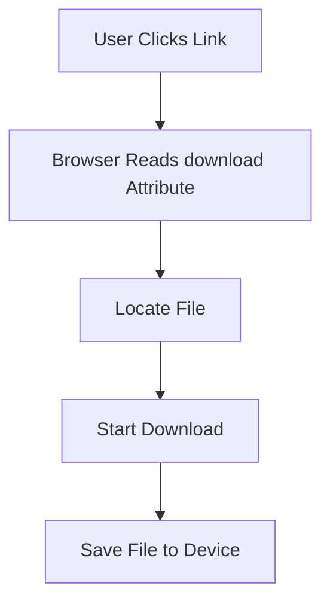
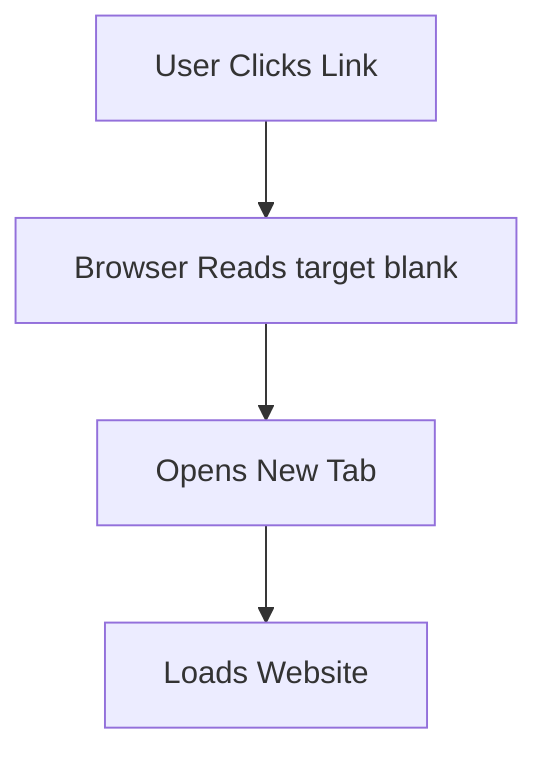
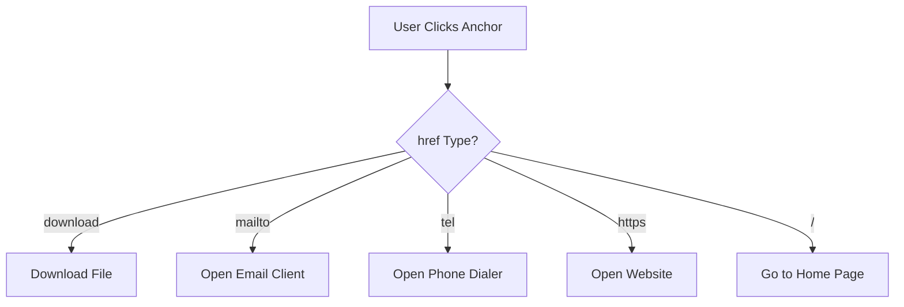
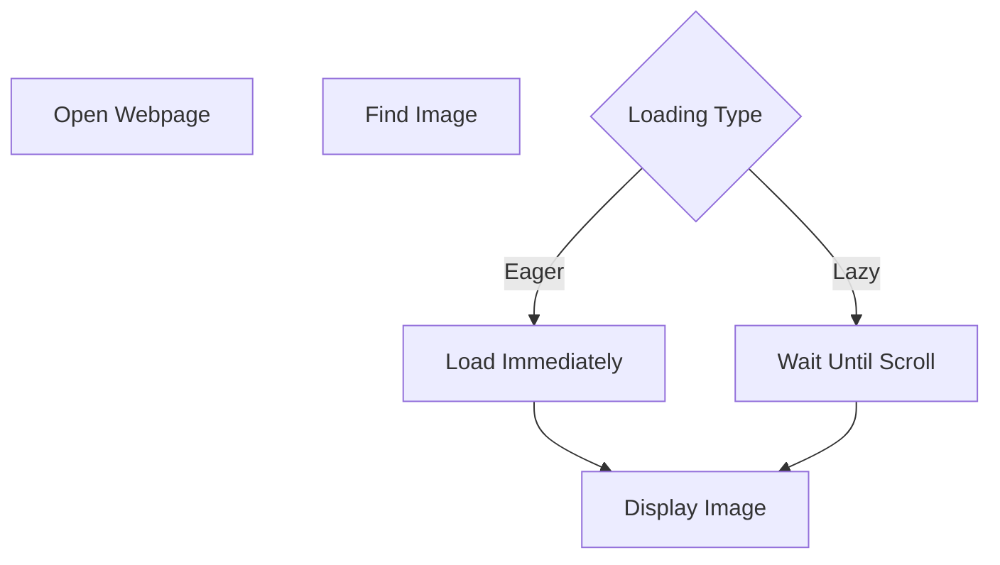

| [⬅️ Semantic HTML](03-Semantic-HTML.md) | [🏠 HTML5 Index](README.md) | [CSS Basics ➔](05-CSS-Basics.md) |
---

# 📖 Module 4: Links, Images & Media

<details open>
<summary><b>📋 What You'll Learn</b></summary>

- Master the **`<a>` anchor element** — internal, external, and special links
- Use **`download`**, **`mailto:`**, **`tel:`**, and **`target="_blank"`** attributes
- Understand **relative**, **root-relative**, and **absolute** URLs
- Embed **images** with proper `alt`, `loading`, `width`, and `height` attributes
- Use **`<figure>`** and **`<figcaption>`** for semantic media grouping
- Embed **`<iframe>`**, **`<video>`**, **`<audio>`**, and **`<picture>`** elements
- Practice with **3 interactive quiz questions**

</details>

---

# Part 1: Hyperlinks (`<a>`)

## 🔗 The Anchor Element

```html
<a href="about.html">About Us</a>
```

The `<a>` element is one of the most important HTML elements. It creates **hyperlinks**, allowing users to navigate between:

- Pages
- Files
- Websites
- Email clients
- Phone dialers
- Sections of a webpage

---

## Types of Links

### Internal Page

```html
<a href="#visit">Jump to Visit Section</a>
```

Moves inside the same page.

### Another HTML File

```html
<a href="about.html">About Page</a>
```

Opens another page in your project.

### External Website

```html
<a href="https://developer.mozilla.org/en-US/">MDN Web Docs</a>
```

Navigates to another website.

---

## Relative vs Absolute URLs

| Type | Example | Meaning |
| :--- | :--- | :--- |
| **Relative** | `about.html` | Look in the current folder |
| **Root-Relative** | `/about` | Start from the website root |
| **Absolute** | `https://google.com` | Full web address |

---

## "Back to Top"

```html
<a href="#">Back to Top</a>
```

`#` points to the top of the current page.

> [!TIP]
> For better accessibility, link to a specific element ID at the top of the page (e.g., `#top`) instead of using a bare `#`.

---

## 1. `download` Attribute

```html
<a href="202.jpg" download>Satoru Gojo</a>
```

### Purpose

The `download` attribute tells the browser: **"Download this file instead of opening it."**

```text
Without download:  Click → Browser Opens Image
With download:     Click → Browser Downloads Image
```

### Browser Workflow



### Supported Files

You can download almost any file type: PDF, Images, Audio, Video, ZIP, Word, Excel.

### Custom File Name

```html
<a href="202.jpg" download="gojo-wallpaper.jpg">
    Download Wallpaper
</a>
```

Downloaded file becomes `gojo-wallpaper.jpg` instead of `202.jpg`.

> [!WARNING]
> The `download` attribute only works for **same-origin** URLs. Cross-origin downloads may be ignored by the browser for security reasons.

---

## 2. `mailto:` Links

```html
<a href="mailto:jyoti@gmail.com">Email Me</a>
```

### Purpose

Opens the user's **default email application**.

```text
Click Email → Open Gmail / Outlook → Create New Email → Recipient Filled
```

### Pre-fill Subject and Body

```html
<a href="mailto:jyoti@gmail.com?subject=Hello&body=Welcome">
    Send Email
</a>
```

Result:

```text
To:      jyoti@gmail.com
Subject: Hello
Body:    Welcome
```

---

## 3. `tel:` Links

```html
<a href="tel:+911234567890">+91 1234567890</a>
```

### Purpose

Creates a clickable phone number. On mobile devices, clicking it opens the phone dialer.

```text
User Clicks Number → Phone App Opens → Number Filled → Ready to Call
```

### Format

```text
tel:+CountryCodeNumber
```

### Where It Works Best

- Smartphones
- Tablets
- Applications with calling support

On desktop browsers, it may open apps such as Skype or Microsoft Teams.

---

## 4. `target="_blank"`

```html
<a href="https://google.com" target="_blank" rel="noopener noreferrer">
    Google
</a>
```

### Purpose

Opens the destination in a **new browser tab**.

```text
Without target:  Current Tab → Google (replaces current page)
With target:     Current Tab + New Google Tab
```

### Browser Workflow



### Security Best Practice

> [!IMPORTANT]
> Whenever using `target="_blank"`, also include `rel="noopener noreferrer"`. This prevents the newly opened page from accessing the original page through `window.opener`, improving security and performance.

---

## 5. Root-Relative URL (`/`)

```html
<a href="/">Back to Home</a>
```

Navigates to the **root (home page)** of the current website.

```text
Current page: example.com/about/contact.html
Click "Back to Home" → example.com/
```

---

## URL Scheme Comparison

| Scheme | Purpose | Example |
| :--- | :--- | :--- |
| `https://` | Open a website | `https://google.com` |
| `mailto:` | Open email client | `mailto:abc@gmail.com` |
| `tel:` | Open dialer | `tel:+911234567890` |
| `/` | Root of current website | `/` |
| `#id` | Jump to a section | `#contact` |

---

## Execution Flow



---

# Part 2: Images & Media

## 🖼️ `` — Image Element

```html

```

### Purpose

The `` element embeds an image into a webpage. It is a **void element** — no closing tag required.

---

## Image Attributes

### `src`

```html
src="img/Anime Cyperbunk Girl.jpg"
```

Specifies the path of the image.

```text
Project
│
├── index.html
│
└── img
      └── Anime Cyperbunk Girl.jpg
```

### `alt`

```html
alt="Anime Girl"
```

Alternative text displayed when:

- Image cannot be loaded
- User is using a screen reader
- Images are disabled

> [!IMPORTANT]
> The `alt` attribute is **required** for accessibility and is one of the most important attributes of the `` element. Write descriptive alt text — not just "image" or "photo".

### `title`

```html
title="Cyberpunk Girl"
```

Displays a tooltip when the mouse hovers over the image. Unlike `alt`, the `title` attribute is optional.

### `width` and `height`

```html
width="1500"
height="1300"
```

Reserve space before the image loads.

Benefits:

- Prevents layout shifting (CLS)
- Improves Core Web Vitals
- Faster page rendering

> [!TIP]
> Always specify `width` and `height` on images. Without them, the browser doesn't know how much space to reserve, causing **Cumulative Layout Shift (CLS)** — one of the Core Web Vitals metrics.

### `loading`

Controls when the browser downloads the image.

| `loading="eager"` | `loading="lazy"` |
| :--- | :--- |
| Loads immediately | Loads only when near viewport |
| Higher initial load | Saves bandwidth |
| Good for hero images, logos | Good for below-the-fold images |

> [!NOTE]
> Never use `loading="lazy"` on images that are visible in the initial viewport (above the fold). This can actually slow down the page by delaying critical content.

---

## `<figure>` & `<figcaption>`

```html
<figure>
    
    <figcaption>Anime City</figcaption>
</figure>
```

### Purpose

`<figure>` represents self-contained content. `<figcaption>` provides a semantic caption.

Common uses: Images, Charts, Diagrams, Illustrations, Code examples.

```text
figure
│
├── img
└── figcaption
```

> [!TIP]
> Use `<figure>` + `<figcaption>` instead of `` + `<p>` for captions. This clearly tells browsers and assistive technologies that the caption belongs to the image.

---

## 🎥 `<video>`

```html
<video src="video.mp4" controls width="640" height="360">
    Your browser does not support the video tag.
</video>
```

### Useful Attributes

| Attribute | Purpose |
| :--- | :--- |
| `controls` | Shows play/pause, volume, and progress bar |
| `autoplay` | Starts playing automatically |
| `loop` | Replays the video after it ends |
| `muted` | Starts with audio muted |
| `width` / `height` | Sets the video dimensions |
| `poster` | Shows a thumbnail before the video plays |

> [!WARNING]
> Most browsers block `autoplay` unless the video is also `muted`. This is a user experience decision to prevent unexpected audio. Use `autoplay muted` for silent background videos.

---

## 🔊 `<audio>`

```html
<audio src="song.mp3" controls>
    Your browser does not support the audio tag.
</audio>
```

### Purpose

Embeds audio content. Works the same as `<video>` but without visual dimensions.

### Attributes

| Attribute | Purpose |
| :--- | :--- |
| `controls` | Shows play/pause and volume |
| `autoplay` | Starts automatically (often blocked) |
| `loop` | Repeats the audio |
| `muted` | Starts muted |
| `preload` | `auto`, `metadata`, or `none` — controls loading strategy |

---

## 🎥 `<iframe>`

```html
<iframe
    src="https://example.com"
    width="600"
    height="400"
    title="Embedded Page">
</iframe>
```

### Purpose

Embeds another HTML page into the current document.

Common uses:

- YouTube videos
- Google Maps
- Interactive widgets
- Third-party content

> [!WARNING]
> iframes can pose **security risks**. Use the `sandbox` attribute to restrict what embedded content can do:
> ```html
> <iframe src="..." sandbox="allow-scripts allow-same-origin"></iframe>
> ```
> Always include a `title` attribute for accessibility.

---

## 🖼️ `<picture>` & `<source>`

```html
<picture>
    <source media="(min-width: 800px)" srcset="large.jpg">
    <source media="(min-width: 400px)" srcset="medium.jpg">
    
</picture>
```

### Purpose

Serves different images based on screen size, resolution, or format support.

The browser picks the **first `<source>` that matches** and falls back to the ``.

### Use Cases

- Serving WebP/AVIF with JPEG fallback
- Art direction (different crops for mobile vs desktop)
- Responsive images based on viewport width

> [!TIP]
> `<picture>` is for **art direction** (different images). For the same image at different resolutions, use `srcset` directly on ``:
> ```html
> 
> ```

---

## `<code>` & `<pre>`

```html
<code>print("Hello")</code>
```

Represents computer code. Browsers display it using a monospace font.

### Best Practice

For multiple lines of code, wrap in `<pre>`:

```html
<pre>
<code>
&lt;h1&gt;Hello World&lt;/h1&gt;
&lt;&lt;&lt; &copy; HTML &gt;&gt;&gt;
</code>
</pre>
```

The `<pre>` element preserves spaces and line breaks.

---

## Image Loading Workflow



---

## Accessibility Notes

✅ Always provide meaningful `alt` text.

```html
<!-- ✅ Good -->


<!-- ❌ Bad -->


```

The alternative text should describe the content or purpose of the image.

---

## W3C Validator Analysis

> [!NOTE]
> Validate your HTML using the **W3C Markup Validation Service**: [https://validator.w3.org/](https://validator.w3.org/)

### Validation Results

| Check | Status | Notes |
| :--- | :--- | :--- |
| `download` attribute | ✅ Valid | Correct usage |
| `mailto:` | ✅ Valid | Correct email URI syntax |
| `tel:` | ✅ Valid | Correct telephone URI syntax |
| `target="_blank"` | ✅ Valid | Works correctly |
| Root-relative URL (`/`) | ✅ Valid | Correct syntax |
| `` | ✅ Valid | Correct syntax |
| `alt` attribute | ✅ Valid | Present on images |
| `loading` attribute | ✅ Valid | Both `eager` and `lazy` are valid |
| `<figure>` / `<figcaption>` | ✅ Valid | Correct semantic grouping |
| External Link Security | ⚠ Improvement | Add `rel="noopener noreferrer"` with `target="_blank"` |
| `<code>` | ⚠ Improvement | Multi-line code should use `<pre><code>` |
| Excessive `<br>` tags | ❌ Poor Practice | Use CSS for spacing instead |

---

## 🧪 Self-Check Questions & Quizzes

### Question 1: Download Attribute ⭐

What does the `download` attribute do on an anchor tag?

<details>
<summary><b>💡 Click to Reveal Solution & Explanation</b></summary>

#### ✅ Solution
It tells the browser to **download the linked file** instead of navigating to it.

#### 🔍 Explanation
Without `download`, clicking a link to an image or PDF would open it in the browser. With `download`, the browser saves it to the user's device instead. You can also specify a custom filename: `download="my-file.pdf"`.
</details>

---

### Question 2: Alt Text ⭐⭐

Why should you never use `alt="image"` or `alt="photo"`?

<details>
<summary><b>💡 Click to Reveal Solution & Explanation</b></summary>

#### ✅ Solution
Because it provides **no useful information** to screen reader users or when the image fails to load.

#### 🔍 Explanation
The `alt` attribute should describe the **content or purpose** of the image. A screen reader user hearing "image" or "photo" gains nothing. Good alt text: `alt="Cyberpunk city skyline at sunset"`. For decorative images, use `alt=""` (empty string) to tell screen readers to skip it.
</details>

---

### Question 3: Loading Strategy ⭐⭐⭐

Why should you NOT use `loading="lazy"` on a hero image at the top of the page?

<details>
<summary><b>💡 Click to Reveal Solution & Explanation</b></summary>

#### ✅ Solution
Because the hero image is **above the fold** — it's visible immediately. Lazy loading would **delay** its appearance, hurting the page's Largest Contentful Paint (LCP) score.

#### 🔍 Explanation
`loading="lazy"` tells the browser to defer loading until the image is near the viewport. For images already in the viewport when the page loads, this adds unnecessary delay. Use `loading="eager"` (the default) for critical above-the-fold images, and `loading="lazy"` for images further down the page.
</details>

---

## 🔑 Key Takeaways

| Concept | Key Point |
| :--- | :--- |
| **`<a>`** | Creates hyperlinks — supports pages, files, email, phone, and sections |
| **`download`** | Downloads files instead of opening them (same-origin only) |
| **`mailto:`** | Opens the email client with pre-filled recipient |
| **`tel:`** | Creates clickable phone numbers for mobile devices |
| **`target="_blank"`** | Opens in new tab — always pair with `rel="noopener noreferrer"` |
| **``** | Embeds images — always include `alt`, `width`, and `height` |
| **`loading`** | `eager` for above-fold; `lazy` for below-fold images |
| **`<figure>`** | Semantic container for media + caption |
| **`<video>`** | Embed video — use `controls`, `muted autoplay` for background |
| **`<audio>`** | Embed audio — same attributes as video |
| **`<iframe>`** | Embed external pages — use `sandbox` for security |
| **`<picture>`** | Responsive images — serves different sources by media query |

---

| [⬅️ Semantic HTML](03-Semantic-HTML.md) | [🏠 HTML5 Index](README.md) | [CSS Basics ➔](05-CSS-Basics.md) |
