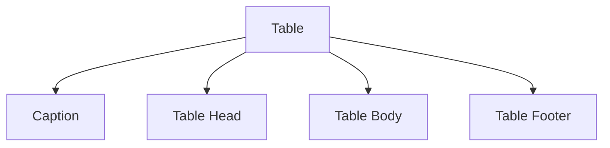
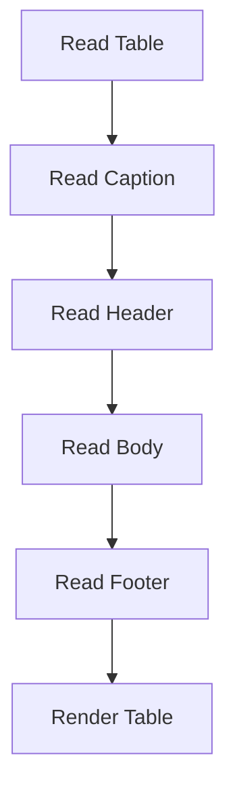

| [⬅️ CSS Basics](05-CSS-Basics.md) | [🏠 HTML5 Index](README.md) | [Forms ➔](07-Forms.md) |
---

# 📖 Module 6: Tables

<details open>
<summary><b>📋 What You'll Learn</b></summary>

- Understand the **semantic table structure**: `<table>`, `<caption>`, `<thead>`, `<tbody>`, `<tfoot>`
- Use **`<tr>`**, **`<th>`**, and **`<td>`** correctly
- Master **`scope`**, **`rowspan`**, and **`colspan`** attributes
- Apply **CSS table styling**: borders, padding, alternating rows
- Practice with **3 interactive quiz questions**

</details>

---

## 📊 What is an HTML Table?

An HTML table displays **structured data** in rows and columns.

Examples:

- Class timetable
- Employee records
- Product prices
- Financial reports
- Cricket scorecards

```text
+---------+---------+-----------+
| Period  | Time    | Activity  |
+---------+---------+-----------+
| Morning | 8–11    | Code      |
| Morning | 11–12   | Reading   |
+---------+---------+-----------+
```

> [!IMPORTANT]
> Tables should be used for **tabular data only** — never for page layout. Using tables for layout breaks accessibility and is considered a legacy anti-pattern from the 1990s.

---

## Table Structure

A semantic HTML table follows this hierarchy:

```text
table
│
├── caption
├── thead
│     └── tr
│          └── th
│
├── tbody
│     └── tr
│          ├── th (row header)
│          └── td
│
└── tfoot
      └── tr
           └── td
```

---

## 1. `<table>`

```html
<table>
```

Creates a table container. All table-related elements must be placed inside it.

---

## 2. `<caption>`

```html
<caption>My Daily Schedule</caption>
```

### Purpose

Provides a title describing the table.

```text
My Daily Schedule
+----------------------+
| Table Data           |
+----------------------+
```

### Why use `<caption>`?

- Improves accessibility
- Helps screen readers identify the table
- Gives context before reading the data

> [!TIP]
> Every meaningful table should include a `<caption>`. It's the table equivalent of a heading.

---

## 3. `<thead>`

```html
<thead>
    <tr>
        <th scope="col">Period</th>
        <th scope="col">Time</th>
        <th scope="col">Activity</th>
    </tr>
</thead>
```

Contains the **column headings**.

---

## 4. `<tbody>`

```html
<tbody>
```

Contains the primary table data. Everything users actually read belongs here.

> [!NOTE]
> If you omit `<tbody>`, the browser will automatically insert one during DOM construction. However, always include it explicitly for clarity and proper styling hooks.

---

## 5. `<tfoot>`

```html
<tfoot>
```

Contains summary or footer information. Browsers and assistive technologies recognize it as the table footer.

---

## Table Flow



---

## 6. `<tr>` — Table Row

```html
<tr>
```

Represents one horizontal row.

```text
+-----------------------------+
| Morning | 8-11 | Write Code |
+-----------------------------+
```

One `<tr>` = One horizontal row.

---

## 7. `<th>` — Header Cell

```html
<th>Period</th>
```

Represents a heading. Unlike `<td>`, browsers automatically:

- Display **bold** text
- **Center align** the text (default)

---

## 8. `<td>` — Data Cell

```html
<td>Write Code</td>
```

Represents normal table data.

### `<th>` vs `<td>`

| `<th>` | `<td>` |
| :--- | :--- |
| Header cell | Data cell |
| Bold by default | Normal text |
| Describes data | Stores data |
| Improves accessibility | Displays values |

---

## 9. `scope` Attribute

```html
<th scope="col">Period</th>
<th scope="row">Morning</th>
```

### Purpose

Tells screen readers **which cells a header describes**.

- `scope="col"` — headers apply to their respective **columns**
- `scope="row"` — headers describe their respective **rows**

> [!IMPORTANT]
> Without `scope`, screen readers may not correctly associate header cells with data cells. Always include it on `<th>` elements for accessible tables.

---

## 10. `rowspan`

```html
<th rowspan="2" scope="row">Morning</th>
```

Merges **2 rows vertically**.

```text
Without rowspan:        With rowspan:
+----------+            +----------+
| Morning  |            | Morning  |
+----------+            |          |
| Morning  |            +----------+
+----------+
```

The single cell spans multiple rows.

---

## 11. `colspan`

```html
<td colspan="2">Sleep</td>
```

Merges **2 columns horizontally**.

```text
Before:              After:
+------+----------+  +------------------+
| Time | Activity |  |      Sleep       |
+------+----------+  +------------------+
```

### `rowspan` vs `colspan`

| `rowspan` | `colspan` |
| :--- | :--- |
| Vertical merge | Horizontal merge |
| Merges rows | Merges columns |

> [!WARNING]
> When using `rowspan` or `colspan`, make sure the adjacent rows/columns have the correct number of cells. Miscounting causes the table to render incorrectly.

---

## Table Rendering Workflow



---

## 🎨 CSS Table Styling

### Basic Table CSS

```css
table, td, th, tr, caption {
    border: 1px solid #eee;
    font-family: 'Courier New', Courier, monospace;
    border-collapse: collapse;
    padding: 0.5rem;
}
```

### `border`

```css
border: 1px solid #eee;
```

Creates borders around table, rows, headers, data cells, and caption.

### `border-collapse`

```text
Without border-collapse:    With border-collapse:
+---+---+                   +---+---+
| | | | |                   |   |   |
+---+---+                   +---+---+
Double borders              Single borders
```

### `padding`

```css
padding: 0.5rem;
```

Adds space **inside** each cell.

```text
Without: |Hello|
With:    | Hello |
```

### `font-family`

```css
font-family: 'Courier New', Courier, monospace;
```

Browser tries in order: Courier New → Courier → any monospace font.

### Advanced Styling

```css
thead {
    background: #444;
}

tbody tr:nth-child(even) {
    background: #3d3d3d;
}

tfoot {
    font-weight: bold;
}

th, td {
    text-align: left;
}
```

> [!TIP]
> Use `tr:nth-child(even)` or `tr:nth-child(odd)` to create **zebra-striped** rows for better readability.

---

## W3C Validator Analysis

### ✅ Correct

All table elements (`<table>`, `<caption>`, `<thead>`, `<tbody>`, `<tfoot>`, `<th>`, `<td>`, `scope`, `rowspan`, `colspan`) are valid HTML5.

### ⚠ Improvements

#### 1. Use `<th>` for row headers

```html
<!-- ❌ Current -->
<td>All other time</td>

<!-- ✅ Better -->
<th scope="row">All other time</th>
```

This row begins with a row heading, so `<th scope="row">` is semantically correct.

---

## 🧪 Self-Check Questions & Quizzes

### Question 1: `<th>` vs `<td>` ⭐

What is the difference between `<th>` and `<td>`?

<details>
<summary><b>💡 Click to Reveal Solution & Explanation</b></summary>

#### ✅ Solution
`<th>` defines **header cells** (bold, centered by default) that describe the data. `<td>` defines **data cells** that contain the actual values.

#### 🔍 Explanation
Screen readers use `<th>` elements to announce column/row headers when navigating table cells, so using them correctly is essential for accessibility.
</details>

---

### Question 2: scope Attribute ⭐⭐

Why is the `scope` attribute important on `<th>` elements?

<details>
<summary><b>💡 Click to Reveal Solution & Explanation</b></summary>

#### ✅ Solution
`scope` tells screen readers **which cells a header describes** — either the column (`scope="col"`) or the row (`scope="row"`).

#### 🔍 Explanation
Without `scope`, screen readers may not correctly associate headers with their data cells, making the table confusing for visually impaired users. In complex tables with both row and column headers, `scope` is essential.
</details>

---

### Question 3: Layout Tables ⭐⭐⭐

Why should you never use HTML tables for page layout?

<details>
<summary><b>💡 Click to Reveal Solution & Explanation</b></summary>

#### ✅ Solution
Because it breaks **accessibility**, **semantics**, and **responsive design**.

#### 🔍 Explanation
Screen readers announce table content as data tables, confusing users when there's no actual tabular data. Tables don't adapt well to different screen sizes. Modern CSS (Flexbox, Grid) provides far superior layout capabilities. Using tables for layout is a legacy anti-pattern from the 1990s.
</details>

---

## 🔑 Key Takeaways

| Concept | Key Point |
| :--- | :--- |
| **`<table>`** | Container for structured, tabular data only |
| **`<caption>`** | Table title — improves accessibility |
| **`<thead>`/`<tbody>`/`<tfoot>`** | Semantic grouping of header, body, and footer |
| **`<tr>`** | Defines a horizontal row |
| **`<th>`** | Header cell — bold, centered, improves a11y |
| **`<td>`** | Data cell — stores actual values |
| **`scope`** | Associates headers with columns (`col`) or rows (`row`) |
| **`rowspan`** | Merges cells vertically across rows |
| **`colspan`** | Merges cells horizontally across columns |
| **`border-collapse`** | Combines adjacent borders into single borders |
| **No layout tables** | Use CSS Flexbox/Grid for page layout — never tables |

---

| [⬅️ CSS Basics](05-CSS-Basics.md) | [🏠 HTML5 Index](README.md) | [Forms ➔](07-Forms.md) |
