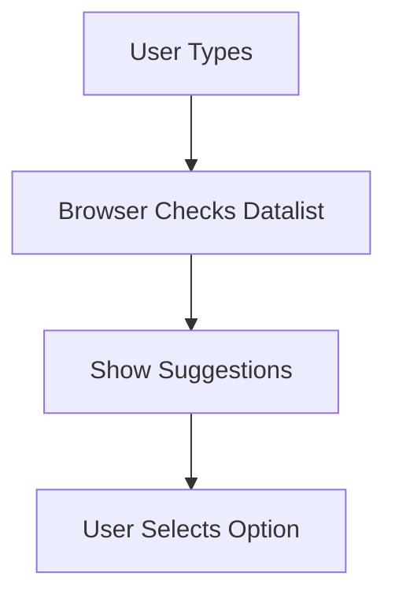

| [⬅️ Tables](06-Tables.md) | [🏠 HTML5 Index](README.md) | [Best Practices ➔](08-Best-Practices.md) |
---

# 📖 Module 7: Forms

<details open>
<summary><b>📋 What You'll Learn</b></summary>

- Understand the **`<form>` element** and its `action` / `method` attributes
- Master the difference between **GET and POST** methods
- Use **`<fieldset>`**, **`<legend>`**, and **`<label>`** for structured, accessible forms
- Explore all **`<input>` types**: text, email, tel, radio, checkbox, and more
- Apply **validation attributes**: `required`, `pattern`, `min`, `max`, `minlength`, `maxlength`
- Use **`<textarea>`**, **`<select>`**, **`<datalist>`**, and **`<button>`** elements
- Understand **form security** and why server-side validation is essential
- Practice with **4 interactive quiz questions**

</details>

---

## 📋 What is an HTML Form?

```html
<form action="https://httpbin.org/get" method="get">
```

A form collects user input and sends it to a server.

```text
User Fills Form → Click Submit → Browser Sends Data → Server Processes
```

---

## `action` Attribute

```html
action="https://httpbin.org/get"
```

Specifies **where** the data is sent.

```text
Form Data → Server at httpbin.org/get
```

---

## `method` Attribute

Defines **how** data is sent.

### GET

```html
<form method="get">
```

Data is added to the URL.

```text
website.com?name=Jyoti
```

Used for: Search, Filters, Non-sensitive data.

### POST

```html
<form method="post">
```

Data is sent inside the request body.

Used for: Passwords, Registration, Payments, Large data.

### GET vs POST

| GET | POST |
| :--- | :--- |
| Data visible in URL | Data hidden from URL |
| Limited size (~2000 chars) | Larger data supported |
| Bookmarkable | Not usually bookmarkable |
| Used for searching | Used for submitting |

> [!WARNING]
> GET exposes form data in the URL and browser history. **Never** use GET for passwords or sensitive information.

---

## `<fieldset>` & `<legend>`

```html
<fieldset>
    <legend>Personal Information</legend>
    <input type="text" name="firstname" placeholder="First Name">
    <input type="email" name="email" placeholder="Email">
</fieldset>
```

### Purpose

`<fieldset>` groups related form controls. `<legend>` provides a title.

```text
+--- Personal Information ---+
|                            |
| First Name: __________     |
| Email:      __________     |
|                            |
+----------------------------+
```

Benefits: Better organization, accessibility, and user experience.

```text
fieldset
│
└── legend
│
└── form controls
```

---

## `<label>` — Form Labels

```html
<label for="username">Username</label>
<input id="username" type="text">
```

### Purpose

Associates a text label with a form control. Clicking the label activates the input.

> [!IMPORTANT]
> The `for` attribute on `<label>` must match the `id` of the input it describes. This is essential for accessibility — screen readers use this association to announce what each input is for.

---

## `<input>` Element

The most commonly used form element. Behavior changes based on the `type` attribute.

### Text Input

```html
<input type="text" placeholder="Enter your name">
```

Used for names, usernames, and short text.

### Email Input

```html
<input type="email" placeholder="Enter your email">
```

Provides email validation. Browser checks format automatically.

```text
✅ Valid: abc@gmail.com
❌ Invalid: abc
```

### Telephone Input

```html
<input type="tel" placeholder="Phone number">
```

On mobile devices, opens the phone keyboard.

> [!NOTE]
> `type="tel"` does **not** validate phone number format by default. Use the `pattern` attribute for format enforcement.

### Password Input

```html
<input type="password" placeholder="Password">
```

Masks the input characters.

### Number Input

```html
<input type="number" min="1" max="100" step="1">
```

Accepts only numeric values with optional min/max constraints.

### Date Input

```html
<input type="date">
```

Provides a native date picker in supported browsers.

### Color Input

```html
<input type="color" value="#ff0000">
```

Opens a color picker.

### Range Input

```html
<input type="range" min="0" max="100" value="50">
```

Displays a slider control.

### Month Input

```html
<input type="month">
```

Allows the user to select a **month and year** (no day). Displays a native month picker in supported browsers.

### Time Input

```html
<input type="time">
```

Allows the user to select a **time** (hours and minutes). Displays a native time picker in supported browsers.

### Number Input

```html
<input type="number" min="1" max="100" step="1">
```

Accepts only numeric values. Attributes:

| Attribute | Purpose |
| :--- | :--- |
| `min` | Minimum value |
| `max` | Maximum value |
| `step` | Increment amount (e.g., `step="5"` allows 0, 5, 10…) |

### Date Input

```html
<input type="date">
```

Provides a native date picker (year, month, day).

### Search Input

```html
<input type="search" placeholder="Search...">
```

Semantically indicates a search field. Some browsers add a clear (`×`) button automatically.

### File Input

```html
<input type="file" accept=".jpg,.png,.pdf">
```

Opens a file picker dialog. The `accept` attribute restricts which file types are shown.

```html
<!-- Allow multiple files -->
<input type="file" multiple>
```

### Hidden Input

```html
<input type="hidden" name="csrf_token" value="abc123">
```

Invisible to the user. Used to pass data with the form that the user should not see or edit (e.g., CSRF tokens, user IDs).

---

## Radio Buttons

```html
<input type="radio" name="food" value="pizza"> Pizza
<input type="radio" name="food" value="burger"> Burger
<input type="radio" name="food" value="pasta"> Pasta
```

Used when users choose **only one option**.

```text
Favorite Food
○ Pizza
○ Burger
○ Pasta
```

> [!IMPORTANT]
> Radio buttons must share the same `name` attribute to form a group. Without it, the browser won't enforce single-selection behavior.

---

## Checkboxes

```html
<input type="checkbox" name="pet" value="dog"> Dog
<input type="checkbox" name="pet" value="cat"> Cat
<input type="checkbox" name="pet" value="bird"> Bird
```

Allows **multiple** selections.

```text
Select Pets
☑ Dog
☑ Cat
☐ Bird
```

### Radio vs Checkbox

| Radio | Checkbox |
| :--- | :--- |
| Single choice | Multiple choices |
| Same `name` required | Independent selections |
| Circle button ○ | Square button ☐ |

---

## Input Attributes

### `name`

```html
<input type="text" name="username" id="username">
```

The **most critical form attribute**. When a form is submitted, the browser sends data as `name=value` pairs.

```text
POST /login
username=jyoti&password=secret
```

> [!IMPORTANT]
> Without a `name` attribute, the input's value is **not sent** to the server when the form is submitted. Always include `name` on every form control you want to collect.

### `placeholder`

```html
placeholder="Enter your first name"
```

Displays temporary hint text. Disappears when user starts typing.

> [!WARNING]
> `placeholder` is **not** a substitute for `<label>`. Placeholders disappear on focus, leaving no visible label. Always use both for accessibility.

### `required`

```html
<input required>
```

Makes the field mandatory. Form won't submit without a value.

### `novalidate` (on `<form>`)

```html
<form novalidate>
```

Disables **all** browser-native validation for the form. Useful when you handle validation entirely in JavaScript.

> [!NOTE]
> `novalidate` is added to the `<form>` element, not individual inputs. It turns off HTML5 built-in validation globally for that form.

### `autocomplete`

```html
autocomplete="on"
```

Allows the browser to suggest previously entered values.

### `autofocus`

```html
<input autofocus>
```

Automatically places the cursor in this field when the page loads. Only one element per page should use `autofocus`.

---

## Validation Attributes

### `pattern`

```html
<input type="tel" pattern="[0-9]{3}-[0-9]{3}-[0-9]{4}" title="Format: 123-456-7890">
```

Creates custom validation rules using regular expressions.

```text
✅ Accepts: 123-456-7890
❌ Rejects: 1234567890
```

| Pattern | Meaning |
| :--- | :--- |
| `[0-9]` | Any digit |
| `{3}` | Exactly three times |
| `[a-zA-Z]` | Any letter |
| `+` | One or more |

### `min` and `max`

```html
<input type="number" min="1" max="100">
```

Restricts the numeric range.

### `minlength` and `maxlength`

```html
<input type="text" minlength="3" maxlength="20">
```

Restricts the character count.

> [!WARNING]
> **Never rely solely on client-side validation.** All validation can be bypassed by disabling JavaScript or using browser dev tools. Always validate on the server too.

---

## `<textarea>`

```html
<textarea rows="10" cols="30" placeholder="Write your feedback"></textarea>
```

Creates multi-line input. Used for messages, comments, and feedback.

| Attribute | Purpose |
| :--- | :--- |
| `rows` | Visible height |
| `cols` | Visible width |

---

## `<select>` — Dropdown

```html
<select>
    <option>2020s</option>
    <option>2010s</option>
    <option>2000s</option>
</select>
```

Creates a dropdown menu.

### `<optgroup>`

```html
<select>
    <optgroup label="Decades">
        <option>1960s</option>
        <option>1970s</option>
    </optgroup>
</select>
```

Groups related options.

### `multiple`

```html
<select multiple>
```

Allows selecting multiple options (Ctrl + Click).

---

## `<datalist>`

```html
<input list="coffee-list" placeholder="Favorite coffee">
<datalist id="coffee-list">
    <option value="Espresso">
    <option value="Latte">
    <option value="Cappuccino">
</datalist>
```

Provides suggestions while typing.

```text
Coffee: lat → Latte (suggestion appears)
```



---

## `<button>` Element Types

```html
<button type="submit">Send</button>
<button type="reset">Clear</button>
<button type="button">Click Me</button>
```

| Type | Behavior |
| :--- | :--- |
| `submit` | Submits the form (default inside `<form>`) |
| `reset` | Clears all form fields |
| `button` | Does nothing by default — needs JavaScript |

> [!TIP]
> Prefer `<button>` over `<input type="submit">` — buttons can contain HTML content (icons, spans) and are more flexible to style.

### `formaction` Override

```html
<button formaction="https://httpbin.org/post" formmethod="post">
    Post
</button>
```

Overrides the form's `action` and `method` for this specific button.

---

## 🔒 Form Security

> [!CAUTION]
> Forms are one of the most common attack vectors on the web. Follow these security practices:
>
> 1. **Always validate on the server** — client-side validation is for UX, not security
> 2. **Use POST for sensitive data** — GET exposes data in URLs and logs
> 3. **Sanitize all input** — prevent XSS (Cross-Site Scripting) attacks
> 4. **Use HTTPS** — encrypt data in transit
> 5. **Add CSRF tokens** — prevent Cross-Site Request Forgery
> 6. **Set `autocomplete="off"`** on sensitive fields like credit card numbers

---

## 🧪 Self-Check Questions & Quizzes

### Question 1: GET vs POST ⭐

When should you use POST instead of GET?

<details>
<summary><b>💡 Click to Reveal Solution & Explanation</b></summary>

#### ✅ Solution
Use POST when submitting **sensitive data** (passwords, payment info) or **large amounts of data**.

#### 🔍 Explanation
GET appends data to the URL, making it visible in browser history, server logs, and bookmarks. POST sends data in the request body, hiding it from the URL. POST also has no practical size limit, unlike GET which is limited to ~2000 characters.
</details>

---

### Question 2: Label Association ⭐

Why must the `for` attribute match the input's `id`?

<details>
<summary><b>💡 Click to Reveal Solution & Explanation</b></summary>

#### ✅ Solution
So clicking the label activates the input, and screen readers can announce which input the label describes.

#### 🔍 Explanation
Without this association, screen readers announce the input as "unlabeled text field," making it impossible for visually impaired users to know what to enter. The `for`-`id` link also increases the click target area, improving usability on mobile.
</details>

---

### Question 3: Radio Button Groups ⭐⭐

What happens if radio buttons don't share the same `name` attribute?

<details>
<summary><b>💡 Click to Reveal Solution & Explanation</b></summary>

#### ✅ Solution
They behave as **independent buttons** — users can select all of them simultaneously, defeating the purpose of single-selection.

#### 🔍 Explanation
The browser uses the `name` attribute to group radio buttons. Only one button within the same `name` group can be selected at a time. Without matching names, each radio button is its own group of one.
</details>

---

### Question 4: Client-Side Validation ⭐⭐⭐

Why should you never rely solely on HTML form validation?

<details>
<summary><b>💡 Click to Reveal Solution & Explanation</b></summary>

#### ✅ Solution
Because **all client-side validation can be bypassed** by disabling JavaScript, using browser dev tools, or sending HTTP requests directly.

#### 🔍 Explanation
HTML attributes like `required`, `pattern`, and `type="email"` improve user experience by catching errors early, but they provide **zero security**. A malicious user can submit any data they want using tools like `curl` or by editing the DOM. Always validate and sanitize input on the server.
</details>

---

## 🔑 Key Takeaways

| Concept | Key Point |
| :--- | :--- |
| **`<form>`** | Collects and submits user data via `action` and `method` |
| **GET vs POST** | GET = URL-visible, limited size; POST = body, larger, more secure |
| **`<fieldset>`** | Groups related controls — use with `<legend>` for a title |
| **`<label>`** | Essential for accessibility — `for` must match input's `id` |
| **Input Types** | `text`, `email`, `tel`, `password`, `number`, `date`, `color`, `range`, `month`, `time`, `search`, `file`, `hidden` |
| **`name` attribute** | Required for form submission — data sent as `name=value` pairs |
| **`novalidate`** | Disables browser validation on the entire form |
| **Radio vs Checkbox** | Radio = one choice (shared name); Checkbox = multiple choices |
| **Validation** | `required`, `pattern`, `min/max`, `minlength/maxlength` |
| **`<textarea>`** | Multi-line input — for messages and feedback |
| **`<select>`** | Dropdown menu — use `<optgroup>` for categories |
| **`<datalist>`** | Auto-suggest while typing |
| **`<button>`** | `submit`, `reset`, or `button` — more flexible than `<input>` |
| **Security** | Always validate server-side; use HTTPS; sanitize all input |

---

| [⬅️ Tables](06-Tables.md) | [🏠 HTML5 Index](README.md) | [Best Practices ➔](08-Best-Practices.md) |
