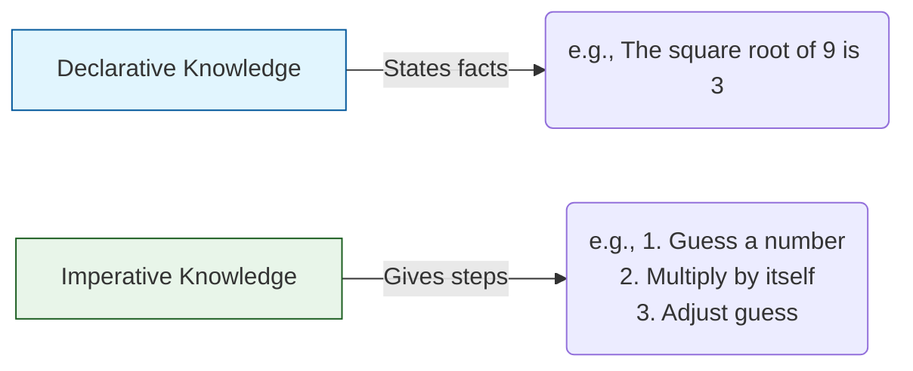

| [🏠 Python Index](README.md) | [02. Strings, Input & Output ➔](02.%20Strings,%20InputOutput,%20and%20Branching.md) |
---

# 📖 Module 1: Introduction to Python

<details open>
<summary><b>📋 What You'll Learn</b></summary>

- Distinguish between **declarative** and **imperative** knowledge
- Write basic Python programs and understand **dynamic typing**
- Work with **built-in data types** (`int`, `float`, `str`, `bool`) and **type casting**
- Use **variable assignment**, **augmented assignment**, and **multiple assignment**
- Evaluate expressions using **operator precedence** and **short-circuit evaluation**
- Recognize and debug common early errors (`SyntaxError` and `TypeError`)
- Apply a systematic problem-solving framework to a **Retail Checkout Challenge**

</details>

---

## 💡 What is Computation?

Computation is about solving problems using computers. Programming focuses on writing recipes that instruct a computer how to generate desired results.

### ⚖️ Declarative vs Imperative Knowledge



Programming is primarily about writing **imperative** recipes to generate facts.

---

## ⚙️ Python Programs

A Python program is a sequence of **definitions** and **commands** evaluated by the Python interpreter.

- **Definitions** are evaluated to bind values to names.
- **Commands (statements)** instruct the interpreter to perform an action.

### Comments

Comments are ignored by the Python interpreter and exist to make code readable for humans.

```python
# This is a single-line comment
x = 10  # Inline comment after a statement
```

> [!TIP]
> Write comments to explain **why** something is done, not **what** is done. The code itself should be clear enough to show the "what."

---

## 🐍 Important Python Fundamentals

> [!IMPORTANT]
> ### Key Points
> 1. **Python is dynamically typed.**
>    - You **do not need to declare the data type** of a variable explicitly.
>    - A variable can **change type** at runtime by reassigning it:
>      ```python
>      x = 5        # x is an int
>      x = "hello"  # x is now a str — no error
>      ```
>
> 2. **Python is case-sensitive.**
>    - Variable names with different letter cases are distinct.
>      ```python
>      age = 20
>      Age = 30
>      ```
>
> 3. **Indentation is mandatory.**
>    - Indentation defines code blocks. The standard is **4 spaces**.
>
> 4. **Keywords are reserved words.**
>    - Examples: `if`, `for`, `True`, `def`. They **cannot be used as variable names**.

### 🏷️ Valid Variable Names (Identifiers)

A valid Python identifier:
- Must start with a **letter** (`a-z`, `A-Z`) or an **underscore** (`_`).
- Can contain letters, digits (`0-9`), and underscores — but **not hyphens, spaces, or symbols**.
- Cannot be a reserved keyword.

```python
# ✅ Valid
my_score = 95
_private = True
data2 = []

# ❌ Invalid
2data = []      # SyntaxError: starts with a digit
my-score = 95   # SyntaxError: hyphens are not allowed
for = 10        # SyntaxError: 'for' is a keyword
```

#### Naming Conventions

- You can write variables in python using 3 ways:
    - Camel case : `sheryiansSchool`
    - Pascal case : `SheryiansSchool`
    - Snake case : `sheryians_school`

---

## 📊 Built-in Data Types & Type Casting

| Type | Description | Example |
| :--- | :--- | :--- |
| `int` | Represents integers | `5`, `-100` |
| `float` | Represents real numbers | `3.27`, `2.0` |
| `complex` | Represents complex numbers (`real + imag j`) | `3 + 4j`, `complex(2, 5)` |
| `bool` | Represents Boolean values | `True`, `False` |
| `str` | Represents text (strings) | `"hello"` |
| `NoneType` | Special type with only one value | `None` |

### 🔍 Checking an Object's Type

Use the `type()` function to determine the **exact** type of an object.

```python
print(type(1234))    # <class 'int'>
print(type(8.99))    # <class 'float'>
print(type(3 + 4j))  # <class 'complex'>
print(type(True))    # <class 'bool'>
```

### 🔄 Type Casting (Explicit Conversion)

You can manually convert between types using built-in functions.

- `int(3.9)` → `3` (Truncates, does **not** round)
- `float("3.14")` → `3.14`
- `float("inf")` / `float("nan")` → Special floating-point values for Infinity and Not-a-Number
- `complex(2, 3)` → `(2+3j)` (Creates complex number with real `2` and imaginary `3`)
- `str(42)` → `"42"`

> [!NOTE]
> `True` behaves mathematically as `1` and `False` as `0`. This means you can perform arithmetic with booleans:
> ```python
> print(True + True)   # 2
> print(False * 10)    # 0
> print(True + False)  # 1
> ```

### 🤔 Predict the Output: Nested Type Casting
What happens when you chain type conversions together? Predict the output of the following code:
```python
x = 3.9
print(float(int(x)))
```

<details>
<summary><b>💡 Click to Reveal Answer</b></summary>

**Output:** `3.0`

**Why?** Operations resolve from the inside out. First, `int(3.9)` executes. Unlike rounding, `int()` **truncates** the decimal, turning it into the integer `3`. Next, `float(3)` executes, converting the integer back into a real number by adding `.0`, resulting in `3.0`.
</details>

---

## 🔗 Assignment Patterns

### Augmented Assignment Operators
Instead of writing `x = x + 1`, Python offers shorthand **augmented assignment** operators that modify a variable in place.

| Operator | Equivalent To | Example (`x = 10`) | Result |
| :---: | :--- | :--- | :--- |
| `+=` | `x = x + n` | `x += 3` | `13` |
| `-=` | `x = x - n` | `x -= 3` | `7` |
| `*=` | `x = x * n` | `x *= 2` | `20` |
| `/=` | `x = x / n` | `x /= 4` | `2.5` |
| `//=` | `x = x // n` | `x //= 3` | `3` |
| `%=` | `x = x % n` | `x %= 3` | `1` |
| `**=` | `x = x ** n` | `x **= 2` | `100` |

> [!TIP]
> Augmented assignment is heavily used inside loops (e.g., `total += value` to accumulate a sum). You will see this pattern constantly starting in Module 3.

### Multiple Assignment

Python allows assigning the same value to several variables at once, or assigning multiple values in a single line.

```python
# Assign the same value to multiple variables
x = y = z = 0
print(x, y, z)  # 0 0 0

# Assign different values simultaneously
a, b = 10, 20
print(a, b)  # 10 20
```

> [!NOTE]
> The simultaneous `a, b = 10, 20` form is actually **tuple packing and unpacking** under the hood. You will learn the full details in Module 6.

### The Walrus Operator (`:=`)

The **walrus operator** (officially called the Assignment Expression) allows you to **assign a value to a variable and return that value in the exact same expression**.

```python
# Traditional Approach (2 lines)
name = "Python"
if len(name) > 5:
    print(f"{name} is long!")

# Walrus Operator Approach (1 line)
if (n := len("Python")) > 5:
    print(f"Length is {n}, which is long!")
```

> [!TIP]
> The walrus operator is incredibly useful in `while` loops (which you will learn about in Module 3) because it lets you calculate a value, assign it to a variable, and check the loop condition all on a single line!

### Interactive Mode Special Variable (`_`)

In interactive mode (REPL / desk calculator), the last printed expression is automatically assigned to the special variable `_`. This makes it easier to continue calculations:

```python
tax = 12.5 / 100
price = 100.50
price * tax
# Output: 12.5625

price + _
# Output: 113.0625

round(_, 2)
# Output: 113.06
```

> [!WARNING]
> This variable should be treated as read-only by the user. Don't explicitly assign a value to it — you would create an independent local variable with the same name masking the built-in variable with its magic behavior.

---

## ➕ Python Operators & Precedence

Operators perform operations on objects and produce a new value.

| Operator | Description | Result Example |
| :---: | :--- | :--- |
| `/` | True Division | `7 / 2` → `3.5` (Always a float) |
| `//` | Floor Division | `7 // 2` → `3` (Rounds toward −∞) |
| `%` | Modulus (Remainder) | `7 % 2` → `1` |
| `**` | Exponentiation | `2 ** 3` → `8` |

> [!NOTE]
> **Numeric Built-in Functions & Special Rules**
> - **`divmod(x, y)`**: Returns the pair `(x // y, x % y)`.
> - **`pow(x, y)`**: Returns `x ** y`. Python defines `pow(0, 0)` and `0 ** 0` to be `1`.
> - **`abs(x)`**: Returns the absolute value or magnitude of `x`.
> - **Complex Arithmetic**: `x + complex(u, v)` yields `complex(x + u, v)` and `x * complex(u, v)` yields `complex(x * u, x * v)`. Use `c.conjugate()` for complex conjugates.
> - **Rounding/Truncation**: `math.trunc(x)` truncates to integer, `math.floor(x)` rounds down, `math.ceil(x)` rounds up, and `round(x, n)` rounds half to even.

> [!WARNING]
> **Floor Division Edge Case**
> `//` rounds toward **negative infinity**, not zero:
> ```python
> -7 // 2    # -4 (not -3)
> ```

### Unary Operators

> **Unary operators** work on **a single operand** (a single value or variable).

**Common Unary Operators:**
- `+x` → Unary Plus (indicates a positive value)
- `-x` → Unary Minus (indicates a negative value)

**Example:**
```python
x = 10

print(+x)   # 10
print(-x)   # -10
```

### 🪪 Identity Operators (`is` and `is not`)

The `is` and `is not` operators are used to check if two variables refer to the **exact same object in memory**, not just if they have the same value.

- `is` → Returns `True` if both variables point to the same object.
- `is not` → Returns `True` if both variables point to different objects.

```python
x = 10
y = 10

# In Python, small integers are cached and share the same memory location
print(x is y)      # True
print(x is not y)  # False
```

> [!NOTE]
> `==` checks for **Equality** (do they have the same value?).
> `is` checks for **Identity** (are they the exact same object?). You will explore this deeply when learning about Lists.

### 🧮 Bitwise Operators

Bitwise operators perform operations on integers at the binary (bit) level.

| Operator | Name | Description | Example (`a = 5` (0101), `b = 3` (0011)) |
| :---: | :--- | :--- | :--- |
| `&` | AND | Sets each bit to 1 if both bits are 1 | `a & b` → `1` (0001) |
| `\|` | OR | Sets each bit to 1 if one of two bits is 1 | `a \| b` → `7` (0111) |
| `^` | XOR | Sets each bit to 1 if only one of two bits is 1 | `a ^ b` → `6` (0110) |
| `~` | NOT | Inverts all the bits | `~a` → `-6` (Inverts bits) |
| `<<` | Zero fill left shift | Shift left by pushing zeros in from the right | `a << 1` → `10` (1010) |
| `>>` | Signed right shift | Shift right by pushing copies of the leftmost bit in from the left | `a >> 1` → `2` (0010) |

> [!TIP]
> **When to use Bitwise Operators?**
> You typically use these for low-level systems programming, cryptography, graphics, and highly optimized algorithms (like competitive programming). For everyday Python programming, standard logical operators (`and`, `or`, `not`) are what you need.

### ⚡ Order of Precedence (Highest → Lowest)

1. `()` → Parentheses
2. `**` → Exponentiation (Right-associative)
3. `~`, `+x`, `-x` → Bitwise NOT and Unary Plus/Minus
4. `*`, `/`, `//`, `%` → Multiplication/Division
5. `+`, `-` → Addition/Subtraction
6. `<<`, `>>` → Bitwise Shifts
7. `&` → Bitwise AND
8. `^` → Bitwise XOR
9. `\|` → Bitwise OR
10. `<`, `<=`, `>`, `>=`, `!=`, `==`, `is`, `in` → Comparisons, Identity, and Membership
11. `not` → Logical NOT
12. `and` → Logical AND
13. `or` → Logical OR
14. `=`, `+=`, `-=`, etc. → Assignment (Lowest)

---

## 🐛 Progressive Debugging: Basic Error Recognition

When programming, you will inevitably encounter errors. Recognizing what Python is telling you is the first step to debugging.

### 1. `SyntaxError` (Grammar Mistakes)
Occurs when you break Python's structural rules before the code even runs.

```python
# Missing closing quote
print("Hello World)  
# SyntaxError: unterminated string literal
```

### 2. `TypeError` (Incompatible Types)
Occurs when an operation is applied to an object of the wrong type.

```python
# Adding a string and an integer
total = "Score: " + 50  
# TypeError: can only concatenate str (not "int") to str
```
**Fix:** Cast the integer to a string first: `str(50)`.

---

## 🧪 Self-Check Questions & Quizzes

## Advanced Practice & Exam-Style Questions

### Question 1: The String Truthiness Trap 💎 (Hidden Gem)

What will the following code output?
```python
is_active = bool("False")
print(is_active)
```

<details>
<summary><b>💡 Click to Reveal Solution & Explanation</b></summary>

#### ✅ Solution
```text
True
```

#### 🔍 Explanation
This is a classic beginner trap! The built-in `bool()` function evaluates whether an object is "truthy" or "falsy". For strings, **any non-empty string is `True`**. It does not read the English word `"False"`. To make it evaluate to `False`, the string must be completely empty `""`.
</details>

---

### Question 1.1: `None` Truthiness 💼

What does this code output?
```python
x = None

print(bool(x))
```

<details>
<summary><b>💡 Click to Reveal Solution & Explanation</b></summary>

#### ✅ Solution
```text
False
```
</details>

---

### Question 2: The Float Casting Trap 🐛 (Debugging)

A junior developer wrote this code to read a price and drop the cents. Why does it crash, and how do you fix it?
```python
# User enters "19.99"
price_input = "19.99"
dollars = int(price_input) 
```

<details>
<summary><b>💡 Click to Reveal Solution & Explanation</b></summary>

#### ✅ Solution & Explanation
It crashes with a `ValueError: invalid literal for int() with base 10: '19.99'`. 

The `int()` function cannot cast a string that contains a decimal point directly to an integer. You must cast it to a `float` first!
**Fix:** `dollars = int(float(price_input))`
</details>

---

### Question 2.1: Chained String Float-to-Int Conversion 💼

Predict the output of the following casting sequence:
```python
num_str = '10.6'
num_float = float(num_str)
num_int = int(num_float)
print(num_int)
```

<details>
<summary><b>💡 Click to Reveal Solution & Explanation</b></summary>

#### ✅ Solution
```text
10
```

#### 🔍 Explanation
Directly calling `int('10.6')` raises a `ValueError` because `int()` expects a valid base-10 integer string. Converting `'10.6'` to `float` first produces `10.6`. Casting `10.6` to `int` truncates the decimal portion `.6`, resulting in the integer `10`.
</details>

---

### Question 3: Negative Floor Division 🔥 (Tricky)

What will this code output?
```python
print(-7 // 2)
```

<details>
<summary><b>💡 Click to Reveal Solution & Explanation</b></summary>

#### ✅ Solution
```text
-4
```

#### 🔍 Explanation
Floor division `//` always rounds **down** towards negative infinity, not towards zero. Since `-7 / 2 = -3.5`, rounding down mathematically means going to `-4`.
</details>

---

### Question 4: The Truthiness of `and` & `or` ⭐⭐⭐ (HOTS)

What does this code output, and why?
```python
print(5 and 10)
print(0 or 7)
```

<details>
<summary><b>💡 Click to Reveal Solution & Explanation</b></summary>

#### ✅ Solution
```text
10
7
```

#### 🔍 Explanation
Logical operators in Python don't just return `True` or `False` — they return the **last evaluated value**.
- `5 and 10`: `5` is truthy. For `and` to be true, it must evaluate the right side. It returns the right side: `10`.
- `0 or 7`: `0` is falsy. For `or` to be true, it evaluates the right side. It returns `7`.
</details>

---

### Question 5: Short-Circuit Debugging 💼 (Advanced)

```python
x = 0
# Will this code crash with a ZeroDivisionError?
print(x != 0 and 10 / x)
```

<details>
<summary><b>💡 Click to Reveal Solution & Explanation</b></summary>

#### ✅ Solution
```text
False
```
*(No crash occurs)*

#### 🔍 Explanation
This demonstrates **Short-Circuit Evaluation**. 
1. Python evaluates `x != 0` → `False`.
2. Since it's an `and` operation, if the first part is `False`, the entire statement *must* be `False`.
3. Python completely **skips** evaluating `10 / x`, preventing the division-by-zero crash. This is a common and highly Pythonic way to protect against runtime errors!
</details>

---

### Question 5.1: Another Short-Circuit 💼

What does this code output?

```python
x = 0

print(x == 0 or 10 / x)
```

<details>
<summary><b>💡 Click to Reveal Solution & Explanation</b></summary>

#### ✅ Solution
```text
True
```

#### 🔍 Explanation
This is another example of **Short-Circuit Evaluation**. Since `x == 0` evaluates to `True`, the `or` operator immediately returns `True` without evaluating the right side (`10 / x`). Thus, no `ZeroDivisionError` occurs.
</details>

---

### Question 5.2: Chained Comparison ⭐

What does this code output?

```python 
x = 7 
print(5 < x < 10) 
```

<details>
<summary><b>💡 Click to Reveal Solution & Explanation</b></summary>

#### ✅ Solution
```text
True
```

#### 🔍 Explanation
Python supports chained comparisons. `5 < x < 10` is equivalent to `5 < x and x < 10`. Since 7 is greater than 5 and less than 10, the result is `True`.
</details>

---

### Question 6: Exponentiation Right-Associativity 🔥 (Tricky)

What does this expression evaluate to? Think carefully before running it.
```python
print(2 ** 3 ** 2)
```

<details>
<summary><b>💡 Click to Reveal Solution & Explanation</b></summary>

#### ✅ Solution
```text
512
```

#### 🔍 Explanation
Most operators are **left-associative** (evaluated left to right). Exponentiation (`**`) is uniquely **right-associative** — it is evaluated from **right to left**.

`2 ** 3 ** 2` is parsed as `2 ** (3 ** 2)` = `2 ** 9` = `512`, **not** `(2 ** 3) ** 2` = `8 ** 2` = `64`.

This is consistent with mathematical convention: `2**(3**2) = 2**9`.
</details>

---

### Question 6.1: Modulo Arithmetic Challenge 🧮 (Output Prediction)

What is the exact output of this expression?

```python
print(15 % 4 + 2 * 3)
```

<details>
<summary><b>💡 Click to Reveal Solution & Explanation</b></summary>

#### ✅ Solution
```text
9
```

#### 🔍 Explanation
Following the PEMDAS/BODMAS rules adapted for Python (where `%`, `*`, and `/` have the same precedence and are evaluated left-to-right before `+` and `-`):
1. `15 % 4` evaluates to `3` (because 15 = 4 * 3 + 3).
2. `2 * 3` evaluates to `6`.
3. `3 + 6` evaluates to `9`.
</details>

---

### Question 7: Augmented Assignment Trap 🐛 (Debugging)

A developer wants to double a score three times. What does this print, and is it correct?
```python
score = 5
score *= 2
score *= 2
score *= 2
print(score)
```
Now consider: what would happen if `score` had been a **string** `"5"` instead of an integer `5`?

<details>
<summary><b>💡 Click to Reveal Solution & Explanation</b></summary>

#### ✅ Solution (integer case)
```text
40
```
`5 → 10 → 20 → 40`. Correct behaviour.

#### ✅ Solution (string case)
```python
score = "5"
score *= 2  # "55"
score *= 2  # "5555"
score *= 2  # "55555555"
print(score)  # 55555555
```
Because `*=` on a string triggers **string repetition**, not arithmetic multiplication. The type of the variable determines the behaviour of the operator — a key consequence of dynamic typing.
</details>

---

### Question 7.1: Tricky Type Conversions 🎓 (University Style)

What will the following code output? (Assume each line is run sequentially in an interactive shell).

```python
print(int(float("5.5")))
print(type(type(5)))
```

<details>
<summary><b>💡 Click to Reveal Solution & Explanation</b></summary>

#### ✅ Solution
```text
5
<class 'type'>
```

#### 🔍 Explanation
1. `float("5.5")` first converts the string to the float `5.5`. Then, `int(5.5)` truncates the decimal, resulting in the integer `5`. Note: Calling `int("5.5")` directly would throw a `ValueError` because the string contains a decimal point.
2. `type(5)` returns `<class 'int'>`. Then `type(<class 'int'>)` returns `<class 'type'>`, because the type of any class itself is `type`.
</details>

---

### Question 7.1: `None` as a Value 💡 (Concept Check)

What does the following code print, and why?
```python
def say_hello(name):
    print(f"Hello, {name}!")

result = say_hello("Priya")
print(result)
```

<details>
<summary><b>💡 Click to Reveal Solution & Explanation</b></summary>

#### ✅ Solution
```text
Hello, Priya!
None
```

#### 🔍 Explanation
This is a critical Python concept! When a function does not have an explicit `return` statement (or returns nothing), Python **automatically returns `None`**. `print()` displays output but always returns `None`. The variable `result` captures that `None`, so printing it shows `None`.

This is why you should never write `result = print("something")` and then try to use `result` as a value — you will only get `None`. (You will see this pattern cause bugs in Module 5's `NoneType` debugging section!)
</details>

---

### Question 7.2: Floating-Point Precision Quirk 🤯 (Advanced)

What will this code print?
```python
print(0.1 + 0.2 == 0.3)
```

<details>
<summary><b>💡 Click to Reveal Solution & Explanation</b></summary>

#### ✅ Solution
```text
False
```

#### 🔍 Explanation
This is a famous computer science gotcha! Computers store floating-point numbers in **base-2 (binary)**, not base-10 (decimal). Some decimal fractions like `0.1` and `0.2` cannot be represented perfectly in binary. 
If you simply `print(0.1 + 0.2)`, Python might show `0.30000000000000004`. Because this is *slightly* larger than `0.3`, the equality check `==` evaluates to `False`.

*Takeaway: Never use `==` to compare floating-point numbers for exact equality! Always check if they are "close enough" (e.g., using `math.isclose()` which you'll learn later).*
</details>

---

## 🏗️ Real-World Challenge: Retail Checkout Calculator

### 📌 Problem Statement
You are building the backend script for a retail store's checkout system. 
Write a script that calculates a customer's final bill.

1. The customer buys 3 laptops.
2. Each laptop costs `$850.50`.
3. The sales tax rate is `8%` (`0.08`).
4. The system needs to print the subtotal, the tax amount, and the final total.

### 🧠 Systematic Problem-Solving Framework

<details>
<summary><b>1. Understand & Break Down</b></summary>

- **Inputs**: Quantity (`3`), Item Price (`850.50`), Tax Rate (`0.08`).
- **Outputs**: Subtotal, Tax Amount, Final Total.
- **Steps**:
  1. Calculate subtotal = price × quantity
  2. Calculate tax = subtotal × tax rate
  3. Calculate final total = subtotal + tax
  4. Print results
</details>

<details>
<summary><b>2. Implementation (Try it yourself first!)</b></summary>

```python
# 1. Define Inputs
quantity = 3
price = 850.50
tax_rate = 0.08

# 2. Perform Calculations
subtotal = quantity * price
tax_amount = subtotal * tax_rate
final_total = subtotal + tax_amount

# 3. Output Results
print("Subtotal: $", subtotal)
print("Tax: $", tax_amount)
print("Final Total: $", final_total)
```
</details>

<details>
<summary><b>3. Edge Cases & Debugging</b></summary>

- **What if the quantity was accidentally entered as a string (`"3"`)?**
  - `subtotal = "3" * 850.50` would raise a `TypeError` because you can't multiply a sequence by a float. Always ensure numerical inputs are properly cast to `int` or `float`!
</details>

---

## 🔑 Key Takeaways

| Concept | Key Point |
| :--- | :--- |
| **Dynamic Typing** | Python infers variable types automatically — no declarations needed |
| **Type Casting** | Use `int()`, `float()`, `str()` to manually convert types |
| **Operator Precedence** | `**` → `*//%` → `+-` → comparisons → `not` → `and` → `or` |
| **Short-Circuit Evaluation** | `and` / `or` stop evaluating as soon as the result is determined |
| **Debugging Basics** | Read the error type (`SyntaxError` vs `TypeError`) to identify the bug class |

---

| [🏠 Python Index](README.md) | [02. Strings, Input & Output ➔](02.%20Strings,%20InputOutput,%20and%20Branching.md) |