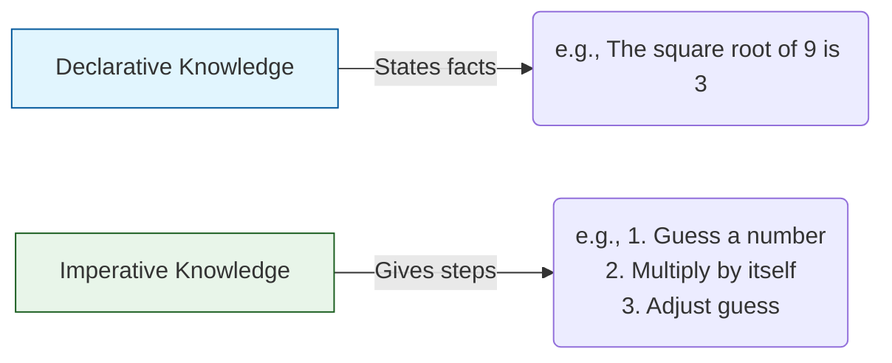

| [🏠 Python Index](README.md) | [02. Strings, Input & Output ➔](2.%20Strings,%20InputOutput,%20and%20Branching.md) |
---

# 📖 Module 1: Introduction to Python

<details open>
<summary><b>📋 What You'll Learn</b></summary>

- Distinguish between **declarative** and **imperative** knowledge
- Write basic Python programs and understand **dynamic typing**
- Work with **built-in data types** (`int`, `float`, `str`, `bool`) and **type casting**
- Evaluate expressions using **operator precedence** and **short-circuit evaluation**
- Recognize and debug common early errors (`SyntaxError` and `TypeError`)
- Apply a systematic problem-solving framework to a **Retail Checkout Challenge**

</details>

---

## 💡 What is Computation?

Computation is about solving problems using computers. Programming focuses on writing recipes that instruct a computer how to generate desired results.

### ⚖️ Declarative vs Imperative Knowledge



Programming is primarily about writing **imperative** recipes to generate facts.

---

## ⚙️ Python Programs

A Python program is a sequence of **definitions** and **commands** evaluated by the Python interpreter.

- **Definitions** are evaluated to bind values to names.
- **Commands (statements)** instruct the interpreter to perform an action.

### Comments

Comments are ignored by the Python interpreter and exist to make code readable for humans.

```python
# This is a single-line comment
x = 10  # Inline comment after a statement
```

> [!TIP]
> Write comments to explain **why** something is done, not **what** is done. The code itself should be clear enough to show the "what."

---

## 🐍 Important Python Fundamentals

> [!IMPORTANT]
> ### Key Points
> 1. **Python is dynamically typed.**
>    - You **do not need to declare the data type** of a variable explicitly.
>    - A variable can **change type** at runtime by reassigning it:
>      ```python
>      x = 5        # x is an int
>      x = "hello"  # x is now a str — no error
>      ```
>
> 2. **Python is case-sensitive.**
>    - Variable names with different letter cases are distinct.
>      ```python
>      age = 20
>      Age = 30
>      ```
>
> 3. **Indentation is mandatory.**
>    - Indentation defines code blocks. The standard is **4 spaces**.
>
> 4. **Keywords are reserved words.**
>    - Examples: `if`, `for`, `True`, `def`. They **cannot be used as variable names**.

---

## 📊 Built-in Data Types & Type Casting

| Type | Description | Example |
| :--- | :--- | :--- |
| `int` | Represents integers | `5`, `-100` |
| `float` | Represents real numbers | `3.27`, `2.0` |
| `bool` | Represents Boolean values | `True`, `False` |
| `str` | Represents text (strings) | `"hello"` |
| `NoneType` | Special type with only one value | `None` |

### 🔍 Checking an Object's Type

Use the `type()` function to determine the **exact** type of an object.

```python
print(type(1234))  # <class 'int'>
print(type(8.99))  # <class 'float'>
print(type(True))  # <class 'bool'>
```

### 🔄 Type Casting (Explicit Conversion)

You can manually convert between types using built-in functions.

- `int(3.9)` → `3` (Truncates, does **not** round)
- `float("3.14")` → `3.14`
- `str(42)` → `"42"`

> [!NOTE]
> `bool` is a subclass of `int`. `True` is mathematically `1` and `False` is `0`. 

---

## ➕ Python Operators & Precedence

Operators perform operations on objects and produce a new value.

| Operator | Description | Result Example |
| :---: | :--- | :--- |
| `/` | True Division | `7 / 2` → `3.5` (Always a float) |
| `//` | Floor Division | `7 // 2` → `3` (Rounds toward −∞) |
| `%` | Modulus (Remainder) | `7 % 2` → `1` |
| `**` | Exponentiation | `2 ** 3` → `8` |

> [!WARNING]
> **Floor Division Edge Case**
> `//` rounds toward **negative infinity**, not zero:
> ```python
> -7 // 2    # -4 (not -3)
> ```

### ⚡ Order of Precedence (Highest → Lowest)

1. `()` → Parentheses
2. `**` → Exponentiation (Right-associative)
3. `*`, `/`, `//`, `%` → Multiplication/Division
4. `+`, `-` → Addition/Subtraction
5. `<`, `<=`, `>`, `>=`, `!=`, `==` → Comparison
6. `not` → Logical NOT
7. `and` → Logical AND
8. `or` → Logical OR
9. `=` → Assignment (Lowest)

---

## 🐛 Progressive Debugging: Basic Error Recognition

When programming, you will inevitably encounter errors. Recognizing what Python is telling you is the first step to debugging.

### 1. `SyntaxError` (Grammar Mistakes)
Occurs when you break Python's structural rules before the code even runs.

```python
# Missing closing quote
print("Hello World)  
# SyntaxError: unterminated string literal
```

### 2. `TypeError` (Incompatible Types)
Occurs when an operation is applied to an object of the wrong type.

```python
# Adding a string and an integer
total = "Score: " + 50  
# TypeError: can only concatenate str (not "int") to str
```
**Fix:** Cast the integer to a string first: `str(50)`.

---

## 🧪 Self-Check Questions & Quizzes

### Question 1: The String Truthiness Trap 💎 (Hidden Gem)

What will the following code output?
```python
is_active = bool("False")
print(is_active)
```

<details>
<summary><b>💡 Click to Reveal Solution & Explanation</b></summary>

#### ✅ Solution
```text
True
```

#### 🔍 Explanation
This is a classic beginner trap! The built-in `bool()` function evaluates whether an object is "truthy" or "falsy". For strings, **any non-empty string is `True`**. It does not read the English word `"False"`. To make it evaluate to `False`, the string must be completely empty `""`.
</details>

---

### Question 2: The Float Casting Trap 🐛 (Debugging)

A junior developer wrote this code to read a price and drop the cents. Why does it crash, and how do you fix it?
```python
# User enters "19.99"
price_input = "19.99"
dollars = int(price_input) 
```

<details>
<summary><b>💡 Click to Reveal Solution & Explanation</b></summary>

#### ✅ Solution & Explanation
It crashes with a `ValueError: invalid literal for int() with base 10: '19.99'`. 

The `int()` function cannot cast a string that contains a decimal point directly to an integer. You must cast it to a `float` first!
**Fix:** `dollars = int(float(price_input))`
</details>

---

### Question 3: Negative Floor Division 🔥 (Tricky)

What will this code output?
```python
print(-7 // 2)
```

<details>
<summary><b>💡 Click to Reveal Solution & Explanation</b></summary>

#### ✅ Solution
```text
-4
```

#### 🔍 Explanation
Floor division `//` always rounds **down** towards negative infinity, not towards zero. Since `-7 / 2 = -3.5`, rounding down mathematically means going to `-4`.
</details>

---

### Question 4: The Truthiness of `and` & `or` ⭐⭐⭐ (HOTS)

What does this code output, and why?
```python
print(5 and 10)
print(0 or 7)
```

<details>
<summary><b>💡 Click to Reveal Solution & Explanation</b></summary>

#### ✅ Solution
```text
10
7
```

#### 🔍 Explanation
Logical operators in Python don't just return `True` or `False` — they return the **last evaluated value**.
- `5 and 10`: `5` is truthy. For `and` to be true, it must evaluate the right side. It returns the right side: `10`.
- `0 or 7`: `0` is falsy. For `or` to be true, it evaluates the right side. It returns `7`.
</details>

---

### Question 5: Short-Circuit Debugging 💼 (Interview)

```python
x = 0
# Will this code crash with a ZeroDivisionError?
print(x != 0 and 10 / x)
```

<details>
<summary><b>💡 Click to Reveal Solution & Explanation</b></summary>

#### ✅ Solution
```text
False
```
*(No crash occurs)*

#### 🔍 Explanation
This demonstrates **Short-Circuit Evaluation**. 
1. Python evaluates `x != 0` → `False`.
2. Since it's an `and` operation, if the first part is `False`, the entire statement *must* be `False`.
3. Python completely **skips** evaluating `10 / x`, preventing the division-by-zero crash. This is a common and highly Pythonic way to protect against runtime errors!
</details>

---

## 🏗️ Real-World Challenge: Retail Checkout Calculator

### 📌 Problem Statement
You are building the backend script for a retail store's checkout system. 
Write a script that calculates a customer's final bill.

1. The customer buys 3 laptops.
2. Each laptop costs `$850.50`.
3. The sales tax rate is `8%` (`0.08`).
4. The system needs to print the subtotal, the tax amount, and the final total.

### 🧠 Systematic Problem-Solving Framework

<details>
<summary><b>1. Understand & Break Down</b></summary>

- **Inputs**: Quantity (`3`), Item Price (`850.50`), Tax Rate (`0.08`).
- **Outputs**: Subtotal, Tax Amount, Final Total.
- **Steps**:
  1. Calculate subtotal = price × quantity
  2. Calculate tax = subtotal × tax rate
  3. Calculate final total = subtotal + tax
  4. Print results
</details>

<details>
<summary><b>2. Implementation (Try it yourself first!)</b></summary>

```python
# 1. Define Inputs
quantity = 3
price = 850.50
tax_rate = 0.08

# 2. Perform Calculations
subtotal = quantity * price
tax_amount = subtotal * tax_rate
final_total = subtotal + tax_amount

# 3. Output Results
print("Subtotal: $", subtotal)
print("Tax: $", tax_amount)
print("Final Total: $", final_total)
```
</details>

<details>
<summary><b>3. Edge Cases & Debugging</b></summary>

- **What if the quantity was accidentally entered as a string (`"3"`)?**
  - `subtotal = "3" * 850.50` would raise a `TypeError` because you can't multiply a sequence by a float. Always ensure numerical inputs are properly cast to `int` or `float`!
</details>

---

## 🔑 Key Takeaways

| Concept | Key Point |
| :--- | :--- |
| **Dynamic Typing** | Python infers variable types automatically — no declarations needed |
| **Type Casting** | Use `int()`, `float()`, `str()` to manually convert types |
| **Operator Precedence** | `**` → `*//%` → `+-` → comparisons → `not` → `and` → `or` |
| **Short-Circuit Evaluation** | `and` / `or` stop evaluating as soon as the result is determined |
| **Debugging Basics** | Read the error type (`SyntaxError` vs `TypeError`) to identify the bug class |

---

| [🏠 Python Index](README.md) | [02. Strings, Input & Output ➔](2.%20Strings,%20InputOutput,%20and%20Branching.md) |