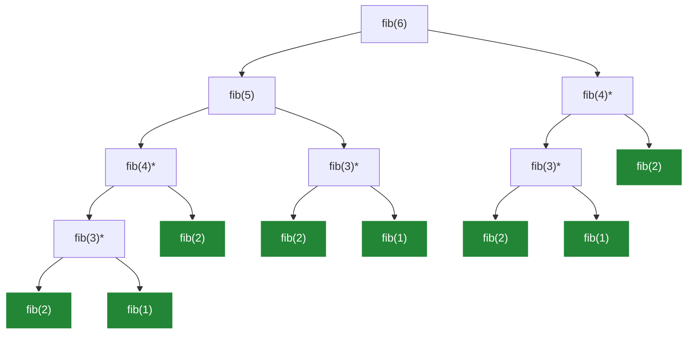
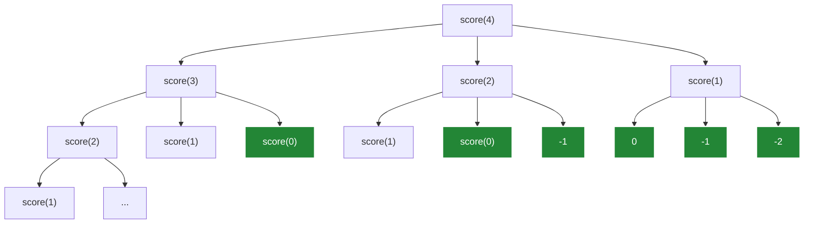
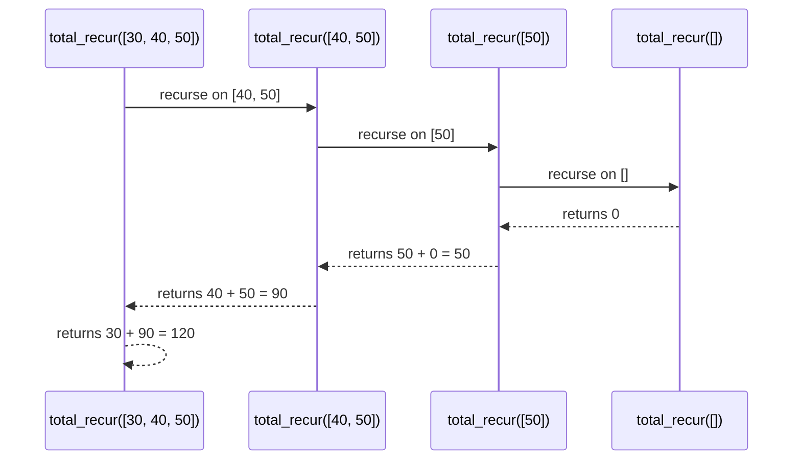

| [⬅️ 09. Dictionaries & Sets](09.%20Dictionaries%20%26%20Sets.md) | [🏠 Python Index](README.md) |
---

# 📖 Module 10: Recursion

<details open>
<summary><b>📋 What You'll Learn</b></summary>

- Understand the concept of **Decomposition** and recursive problem solving
- Identify the two mandatory components: **Base Case** and **Recursive Step**
- Trace the **Call Stack** and understand scope isolation across frames
- Enforce the **Consistent Return Type Rule** to prevent runtime bugs
- Differentiate **Iterative** vs. **Recursive** implementations (Factorial & Power)
- Analyze **Tree Recursion** (Fibonacci) and state-space growth
- Optimize exponential algorithms using **Memoization** with dictionaries
- Apply recursion to **List structures** using Head (`L[0]`) and Tail (`L[1:]`)
- Solve list problems: linear search, string length sum, and 1-level flattening
- Master **Deep Recursion** for arbitrary nested list structures (`deep_rev`)
- Practice with top university exam questions (MIT, Stanford, IIT)

</details>

---

## 🔄 Introduction: Decomposing Problems

The central idea behind **recursion** is **decomposition**: breaking a complex problem down into a smaller version of the exact same problem.

### Iterative vs. Recursive Mindset (Example: Multiplication)

Multiplication `a * b` can be defined as adding `a` to itself `b` times.

#### 1. Iterative Solution (Accumulation)

```python
def mult_iter(a, b):
    result = 0
    while b > 0:
        result += a
        b -= 1
    return result
```

In the iterative version, we explicitly maintain and update state variables (`result` and `b`) inside a loop.

#### 2. Decomposing the Problem

Instead of thinking of `5 * 4` as `5 + 5 + 5 + 5` all at once:

```text
5 × 4
= 5 + (5 × 3)
= 5 + (5 + (5 × 2))
= 5 + (5 + (5 + (5 × 1)))
```

Notice the fundamental algebraic pattern:
```text
a × b = a + (a × (b - 1))
```

The original problem `a * b` is converted into a **smaller version of the same problem**: `a * (b - 1)`.

#### 3. The Recursive Solution

```python
def mult_recur(a, b):
    if b == 1:
        return a
    else:
        return a + mult_recur(a, b - 1)
```

---

## 📖 Core Concepts of Recursion

### What is Recursion?

Algorithmically, recursion is a problem-solving strategy based on **decrease-and-conquer** or **divide-and-conquer**. Semantically, it occurs when a function **calls itself**.

Every valid recursive algorithm requires two components:

1. **Base Case**: The simplest, smallest input that can be solved directly without making further recursive calls.
2. **Recursive Step**: Reduces the problem to one or more smaller instances of the same problem and calls the function recursively.

> [!IMPORTANT]
> Every recursive call **must make progress toward the base case**. Without a reachable base case, the program will execute indefinitely until Python raises a `RecursionError` (Stack Overflow).

---

### Step-by-Step Execution Trace

Let me trace `mult_recur(5, 4)`:

```text
mult_recur(5, 4)
  ΓööΓöÇ> 5 + mult_recur(5, 3)
        ΓööΓöÇ> 5 + mult_recur(5, 2)
              ΓööΓöÇ> 5 + mult_recur(5, 1)
                    ΓööΓöÇ> returns 5  (Base Case reached)
```

Once the base case returns, values propagate back up the call stack:

```text
mult_recur(5, 1) returns 5
mult_recur(5, 2) returns 5 + 5 = 10
mult_recur(5, 3) returns 5 + 10 = 15
mult_recur(5, 4) returns 5 + 15 = 20
```

```text
RECURSIVE CALL SEQUENCE
       Γåô
Decompose into smaller subproblem
       Γåô
Reach BASE CASE
       Γåô
Unwind stack & build result upward
```

> [!WARNING]
> **Common Edge-Case Bug**  
> What happens if you run `mult_recur(5, 0)` on the implementation above?  
> Since `b == 1` is never satisfied, `b` decrements endlessly (`-1, -2, -3...`), leading to a `RecursionError`.
> 
> **Mini-Challenge:** How can we adjust the base case to safely handle `b == 0`?
> <details>
> <summary><b>Solution</b></summary>
> 
> ```python
> def mult_recur_safe(a, b):
>     if b == 0:
>         return 0
>     elif b < 0:
>         return -mult_recur_safe(a, -b)
>     else:
>         return a + mult_recur_safe(a, b - 1)
> ```
> </details>

---

### Separate Scope & The Call Stack

> [!NOTE]
> Every recursive function call creates a completely new, isolated **stack frame** with its own variable bindings.

Consider calculating factorial recursively:

```python
def fact_recur(n):
    if n == 0 or n == 1:
        return 1
    else:
        return n * fact_recur(n - 1)
```

When `fact_recur(4)` executes:

```text
Frame 4: n = 4 | Waiting for fact_recur(3)
  Frame 3: n = 3 | Waiting for fact_recur(2)
    Frame 2: n = 2 | Waiting for fact_recur(1)
      Frame 1: n = 1 | Returns 1 immediately
```

The variable `n` in Frame 4 is **not** overwritten when Frame 3 runs. Each function invocation manages its own local parameters and environment.

> [!TIP]
> **Quick Check: Parameter Renaming**  
> If you change `def fact_recur(n)` to use `x` inside the recursive call, does it change the execution behavior?  
> No. Variable bindings are strictly bound to their respective stack frame.

---

### The Consistent Return Type Rule

> [!CAUTION]
> Every branch of a recursive function (base cases AND recursive steps) MUST return compatible data types.

**Incorrect (Type Mismatch Bug):**
```python
def search_element(L, target):
    if len(L) == 0:
        return False       # Returns bool
    elif L[0] == target:
        return True        # Returns bool
    else:
        return len(L)      # Bug: Returns int!
```

Because callers upstream rely on the return value to combine results, type inconsistencies lead to runtime errors (e.g., trying to add an `int` to a `bool` or `None`).

---

## 🧮 Classic Mathematical Recursion

### 1. Power Function (n^p)

Mathematical definition:
- `n^p = 1` if `p == 0`
- `n^p = n * n^(p-1)` if `p > 0`

```python
def power_recur(n, p):
    if p == 0:
        return 1
    else:
        return n * power_recur(n, p - 1)

print(power_recur(2, 4))  # 16
```

> [!NOTE]
> **Code-Tracing Challenge**  
> Trace `power_recur(3, 3)`:
> 1. `power_recur(3, 3)` -> `3 * power_recur(3, 2)`
> 2. `power_recur(3, 2)` -> `3 * power_recur(3, 1)`
> 3. `power_recur(3, 1)` -> `3 * power_recur(3, 0)`
> 4. `power_recur(3, 0)` -> returns `1`
> 5. Propagates back: `3 * 1 = 3` -> `3 * 3 = 9` -> `3 * 9 = 27`. Output: `27`.

---

### 2. Factorial Function (n!)

```python
def factorial_iter(n):
    prod = 1
    for i in range(1, n + 1):
        prod *= i
    return prod

def fact_recur(n):
    if n == 0 or n == 1:
        return 1
    else:
        return n * fact_recur(n - 1)
```

#### Comparison: Iteration vs. Recursion

| Feature | Iteration | Recursion |
| :--- | :--- | :--- |
| **Mechanism** | Explicit loop (`while` / `for`) | Function self-invocation |
| **State Tracking** | Modified loop variables in place | Frame-by-frame call stack |
| **Memory Cost** | O(1) auxiliary space | O(N) call stack space |
| **Readability** | Straightforward for simple loops | Highly clean for hierarchical / branching data |

---

## ΓÜí Tree Recursion & Memoization

### The Fibonacci Sequence

Fibonacci numbers are defined by two base cases and two recursive branches:
- `F(1) = 1`, `F(2) = 1`
- `F(n) = F(n-1) + F(n-2)` for `n > 2`

```python
def fib(n):
    if n == 1 or n == 2:
        return 1
    else:
        return fib(n - 1) + fib(n - 2)

print(fib(6))  # 8
```

---

### The Inefficiency of Naive Tree Recursion

When a function calls itself **more than once** per step, it creates a **recursion tree**.

Execution tree for `fib(6)`:



> **Legend:**
> - `[fib(n)]` : Base cases that return 1 immediately.
> - `*` : Redundant, repeated recursive calls.

Notice the redundant work:
- `fib(4)` is computed **2 times**.
- `fib(3)` is computed **3 times**.
- `fib(2)` is computed **5 times**.

The time complexity of naive `fib(n)` is exponential: **O(2^n)**!

---

### Optimization with Memoization

**Memoization** is an optimization technique where you store (cache) the results of expensive function calls in a data structure (like a dictionary) and return the cached result when the same inputs occur again.

```python
def fib_efficient(n, memo=None):
    if memo is None:
        memo = {}
    if n in memo:
        return memo[n]
    if n == 1 or n == 2:
        memo[n] = 1
        return 1
    
    ans = fib_efficient(n - 1, memo) + fib_efficient(n - 2, memo)
    memo[n] = ans
    return ans

# Usage
print(fib_efficient(34))   # Fast!
```

#### Performance Impact

| Input n | Naive `fib(n)` Calls | Memoized `fib_efficient(n)` Calls |
| :---: | :---: | :---: |
| 10 | 109 | 17 |
| 20 | 13,529 | 37 |
| 34 | 11,405,773 | 65 |

Time complexity drops from exponential **O(2^n)** down to linear **O(n)**.

> [!IMPORTANT]
> **When is Memoization Safe?**  
> Memoization works for **pure functions**: functions that produce identical output for identical inputs and have no side effects.

---

### Application: Step-Counting Problem (Basketball Scores)

Suppose a team can score points in steps of `1`, `2`, or `3` points. How many distinct ways can they form a total score of `n` points?

```python
def score_count(n, memo=None):
    if memo is None:
        memo = {}
    if n in memo:
        return memo[n]
    
    # Base cases
    if n < 0:
        return 0
    if n == 0:
        return 1
        
    ans = score_count(n - 1, memo) + score_count(n - 2, memo) + score_count(n - 3, memo)
    memo[n] = ans
    return ans

print(score_count(4))  # Output: 7
```

*(Ways for n=4: `1+1+1+1`, `1+1+2`, `1+2+1`, `2+1+1`, `2+2`, `1+3`, `3+1`)*

#### High-Level Execution Tree for `score_count(4)`


Notice how each call branches into three smaller subproblems (for 1, 2, or 3 points) until reaching the base cases, creating overlapping subproblems (e.g. `score(2)` is computed multiple times).

---

## 📜 Recursion on Data Structures: Lists

Lists in Python have an inherently recursive structure:
- **Head**: The first element `L[0]`
- **Tail**: The sublist of all remaining elements `L[1:]`

```text
  [ 30  ,  40  ,  50 ]
    Γöé      ΓööΓöÇΓöÇΓöÇΓöÇΓöÇΓöÇΓöÇΓöÇΓöÇΓöÿ
  Head        Tail
  L[0]        L[1:]
```

### Example 1: Summing a List Recursively

```python
def total_recur(L):
    if len(L) == 0:
        return 0
    else:
        return L[0] + total_recur(L[1:])

test = [30, 40, 50]
print(total_recur(test))  # 120
```

#### Visualizing the Recursive Extraction
Each function call extracts `L[0]` and passes `L[1:]` to the next call, decreasing the problem size step-by-step:



---

### Example 2: Total Length of String Elements

```python
def total_len_recur(L):
    if len(L) == 0:
        return 0
    else:
        return len(L[0]) + total_len_recur(L[1:])

words = ["ab", "c", "defgh"]
print(total_len_recur(words))  # 8 (2 + 1 + 5)
```

---

## 🔍 Searching & Flattening Lists

### 1. Linear Search in a List (`in_list`)

We want to test if an element `e` is in list `L`.

```python
def in_list(L, e):
    if len(L) == 0:
        return False
    elif L[0] == e:
        return True
    else:
        return in_list(L[1:], e)

print(in_list([2, 5, 8, 1], 8))  # True
print(in_list([2, 5, 8, 1], 9))  # False
```

> [!WARNING]
> **Debugging Mini-Challenge: The Skipped Element Bug**  
> Consider this flawed implementation:
> ```python
> def buggy_in_list(L, e):
>     if len(L) == 1:
>         return L[0] == e
>     else:
>         return buggy_in_list(L[1:], e)
> ```
> Why does `buggy_in_list([2, 1, 5, 8], 1)` return `False`?
> <details>
> <summary><b>Answer</b></summary>
> 
> It only checks if the *last* element matches! It completely skips checking `L[0] == e` during the recursive step and just passes `L[1:]` down. You must check `L[0]` *before* recursing, or handle empty lists as the base case as shown in the correct implementation.
> </details>

---

### 2. Flattening One Level of Nested Lists

Given `[[1, 2], [3, 4], [9, 8, 7]]`, flatten into a single list `[1, 2, 3, 4, 9, 8, 7]`.

```python
def flatten(L):
    if len(L) == 0:
        return []
    else:
        return L[0] + flatten(L[1:])

print(flatten([[1, 2], [3, 4], [9, 8, 7]]))  # [1, 2, 3, 4, 9, 8, 7]
```

---

### 3. Searching inside a List of Lists

```python
def in_list_of_lists(L, e):
    if len(L) == 0:
        return False
    elif in_list(L[0], e):
        return True
    else:
        return in_list_of_lists(L[1:], e)

test = [[1, 2], [3, 4], [5, 6, 7]]
print(in_list_of_lists(test, 4))  # True
print(in_list_of_lists(test, 9))  # False
```

---

## 🌲 Deep Recursion on Arbitrary Nesting

### Why Iteration Fails for Arbitrary Nesting

Consider a deeply nested list with arbitrary levels of depth:
```python
L = [1, [2, [3, [4, 5]], 6], 7]
```

With iteration, handling **unknown depth** would require an unknown number of nested `for` loops:
```python
for i in L:
    if type(i) == list:
        for j in i:
            if type(j) == list:
                # ... and so on ...
```
This is a classic use case for recursion! Similar to exploring a maze where you don't know how many turns are left, recursion handles arbitrary depth naturally by calling itself whenever an element is a sublist. Other naturally recursive domains include **file systems**, **bureaucracy**, and **mathematical order of operations**.

---

### Shallow Reversal vs. Deep Reversal

#### Shallow Reversal (Only Reverses Top Level)

```python
def shallow_rev(L):
    if len(L) == 0:
        return []
    else:
        return shallow_rev(L[1:]) + [L[0]]

print(shallow_rev([1, 2, [3, 4]]))  # [[3, 4], 2, 1]
```

Notice that `[3, 4]` remains un-reversed inside the output.

---

#### Deep Reversal (Reverses Top Level AND All Sublists)

```python
def deep_rev(L):
    if len(L) == 0:
        return []
    elif type(L[0]) == list:
        return deep_rev(L[1:]) + [deep_rev(L[0])]
    else:
        return deep_rev(L[1:]) + [L[0]]

print(deep_rev([1, 2, [3, 4]]))  # [[4, 3], 2, 1]
print(deep_rev([1, [2, [3, 4]]]])) # [[[4, 3], 2], 1]
```

```text
Decision Tree per Element:
          Is L[0] a list?
            /        \
         Yes          No
        /              \
  Recursively        Keep element
  deep_rev(L[0])     as-is
```

---

## 💡 Mental Model & Best Practices

### Mental Model Checklist

When writing any recursive function, answer these 5 questions:

1. **What is the Base Case?** What is the simplest input where the answer is known immediately?
2. **What is the Recursive Step?** How do I decompose the input into a smaller version?
3. **Does it make progress?** Am I moving closer to the base case with every call?
4. **How do I combine results?** Am I using `+`, `*`, list concatenation, or boolean logic?
5. **Are return types consistent?** Does every branch return the exact same data type?

---

## 🏋️ Practice Problems

### Practice 1: `count_even_recur()`
Write a recursive function that counts how many even numbers are in a list.

```python
def count_even_recur(L):
    if len(L) == 0:
        return 0
    elif L[0] % 2 == 0:
        return 1 + count_even_recur(L[1:])
    else:
        return count_even_recur(L[1:])

print(count_even_recur([1, 2, 3, 4, 6]))  # 3
```

### Practice 2: `max_recur()`
Find the maximum element in a non-empty list of numbers recursively.

```python
def max_recur(L):
    if len(L) == 1:
        return L[0]
    else:
        sub_max = max_recur(L[1:])
        return L[0] if L[0] > sub_max else sub_max

print(max_recur([3, 7, 2, 9, 4]))  # 9
```

---

## 🧪 Self-Check Questions & Quizzes

## Advanced Practice & Exam-Style Questions

### Question 1: String Palindrome Check 💡 (Basic)

Write a recursive function `is_palindrome(s)` that returns `True` if string `s` is a palindrome and `False` otherwise.

<details>
<summary><b>💡 Click to Reveal Solution & Explanation</b></summary>

#### ✅ Solution
```python
def is_palindrome(s):
    if len(s) <= 1:
        return True
    if s[0] != s[-1]:
        return False
    return is_palindrome(s[1:-1])

print(is_palindrome("racecar"))  # True
print(is_palindrome("python"))   # False
```

#### 🔍 Explanation
- **Base Case:** Any string of length 0 or 1 is automatically a palindrome (`True`).
- **Reduction:** Compare the first (`s[0]`) and last (`s[-1]`) characters. If they match, strip them off with `s[1:-1]` and solve the smaller substring.
</details>

---

### Question 2: Deep Sum of Nested Lists 🧠 (Intermediate)

Write a recursive function `deep_sum(L)` that calculates the sum of all numbers in a nested list structure of arbitrary depth.

<details>
<summary><b>💡 Click to Reveal Solution & Explanation</b></summary>

#### ✅ Solution
```python
def deep_sum(L):
    if len(L) == 0:
        return 0
    elif type(L[0]) == list:
        return deep_sum(L[0]) + deep_sum(L[1:])
    else:
        return L[0] + deep_sum(L[1:])

print(deep_sum([1, [2, [3, 4]], 5]))  # 15
```

#### 🔍 Explanation
If `L[0]` is a sublist, we make two recursive calls: one to sum inside `L[0]` (`deep_sum(L[0])`), and one to sum the rest of the list (`deep_sum(L[1:])`), then add them together.
</details>

---

### Question 3: Code Tracing — Russian Peasant Fast Multiplication 💼 (Stanford / MIT Style)

What is the output of `mystery(3, 4)` and what mathematical operation does `mystery(a, b)` compute?

```python
def mystery(a, b):
    if b == 0:
        return 0
    elif b % 2 == 0:
        return mystery(a + a, b // 2)
    else:
        return a + mystery(a + a, (b - 1) // 2)
```

<details>
<summary><b>💡 Click to Reveal Solution & Explanation</b></summary>

#### ✅ Solution
Output for `mystery(3, 4)` is `12`.

#### 🔍 Explanation
**Step-by-step trace:**
1. `mystery(3, 4)` -> `b=4` is even -> `mystery(6, 2)`
2. `mystery(6, 2)` -> `b=2` is even -> `mystery(12, 1)`
3. `mystery(12, 1)` -> `b=1` is odd -> `12 + mystery(24, 0)`
4. `mystery(24, 0)` -> `b=0` -> returns `0`
5. Unwinds: `12 + 0 = 12`.

**Mathematical Analysis:**
This implements **Russian Peasant Multiplication** (binary multiplication). It calculates `a * b` in **O(log b)** steps instead of O(b) steps!
</details>

---

### Question 4: Grid Path Counting & Default Parameter Trap 🔥 (IIT / MIT Style)

Consider the following recursive function:

```python
def count_paths(m, n, memo=None):
    if memo is None:
        memo = {}
    if (m, n) in memo:
        return memo[(m, n)]
    if m == 1 or n == 1:
        return 1
    
    memo[(m, n)] = count_paths(m - 1, n, memo) + count_paths(m, n - 1, memo)
    return memo[(m, n)]

print(count_paths(3, 3))
```

1. What is the output of `count_paths(3, 3)`?
2. What classic grid problem does this function solve?
3. Why is defining `memo=None` preferable to `memo={}` in Python function headers?

<details>
<summary><b>💡 Click to Reveal Solution & Explanation</b></summary>

#### ✅ Solution
1. **Output:** `6`
2. **Problem Solved:** Counts unique grid paths from top-left `(0,0)` to bottom-right `(m-1, n-1)` in an `m x n` grid moving only down or right.
3. **Default Parameter Trap:** Default arguments (like `memo={}`) are evaluated **once** when the function is defined. If you use `memo={}`, the same dictionary persists across separate calls, causing state leaks. Using `memo=None` ensures a fresh dictionary is initialized for every new top-level invocation.
</details>

---

## 🏗️ Real-World Challenge: Directory File Count

### 📌 Problem Statement
You are building a file explorer feature. Given a nested directory structure represented as a nested dictionary, write a recursive function `count_files(directory)` that returns the total count of files.

```python
file_system = {
    "documents": {
        "resume.pdf": 1,
        "cover_letter.pdf": 1,
    },
    "photos": {
        "vacation": {
            "beach.jpg": 1,
            "sunset.jpg": 1
        },
        "profile.png": 1
    },
    "notes.txt": 1
}
```

<details>
<summary><b>🧠 Solution & Implementation</b></summary>

```python
def count_files(directory):
    total = 0
    for key, value in directory.items():
        if type(value) == dict:
            # Recurse into subfolder
            total += count_files(value)
        else:
            # It's a file!
            total += 1
    return total

print(count_files(file_system))  # Output: 5
```
</details>

---

## 🔑 Key Takeaways

| Concept | Key Point |
| :--- | :--- |
| **Base Case & Recursive Step** | Every recursive function needs a base case to stop and a recursive step that makes progress. |
| **Multiple Base Cases** | It is perfectly valid to have more than 1 base case and multiple `if/elif` branches. |
| **Call Stack Frames** | Every call gets its own isolated stack frame; local variables do not overwrite each other. |
| **Consistent Return Type** | Every branch must return compatible types to avoid runtime bugs when combining results. |
| **Tree Recursion & Memoization** | Multiple recursive calls per step create exponential O(2^n) trees; memoize with dicts to get O(n). |
| **List Recursion (Head/Tail)** | Process `L[0]` (head) and recurse on `L[1:]` (tail). |
| **Deep Recursion & Use Cases** | Use `type(element) == list` checks to handle arbitrary nesting depths (e.g., file systems). |

---

| [⬅️ 09. Dictionaries & Sets](09.%20Dictionaries%20%26%20Sets.md) | [🏠 Python Index](README.md) |
