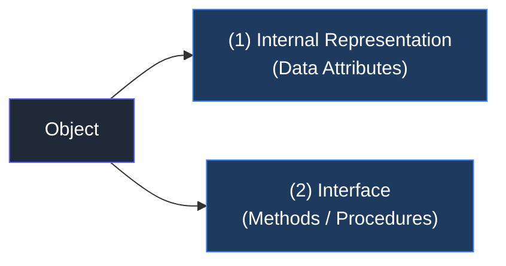
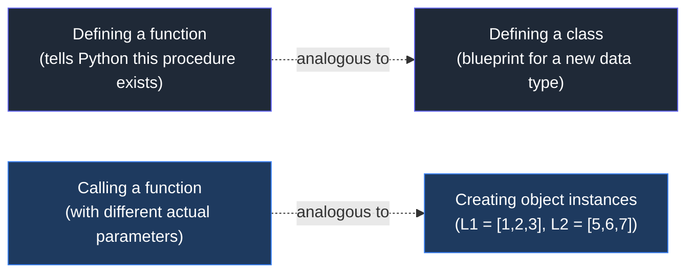
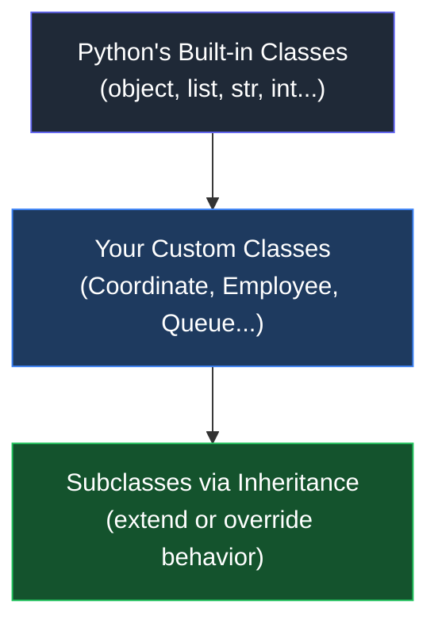
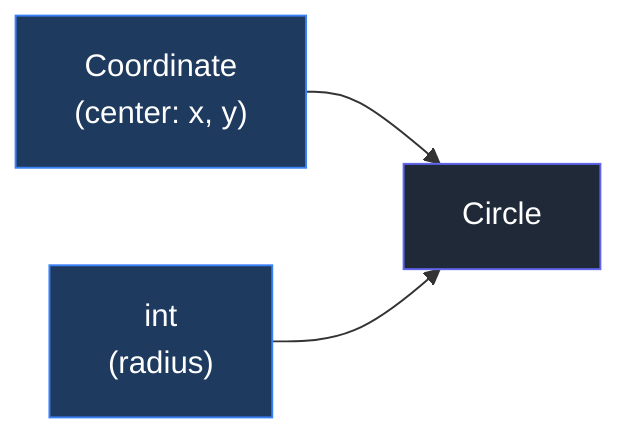
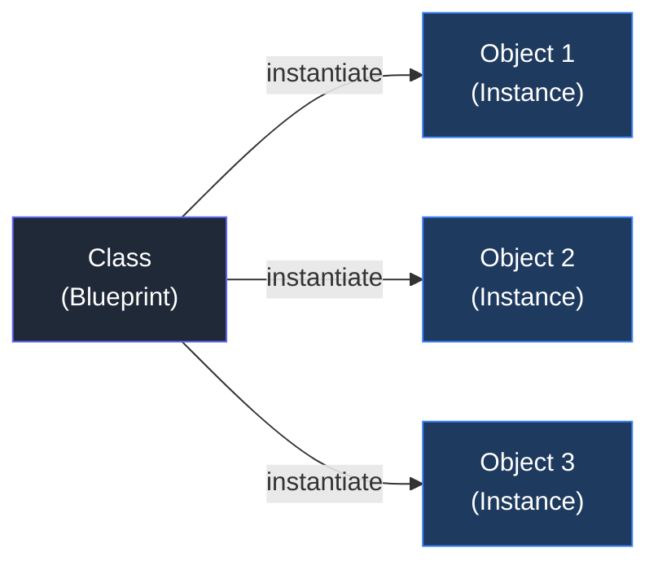
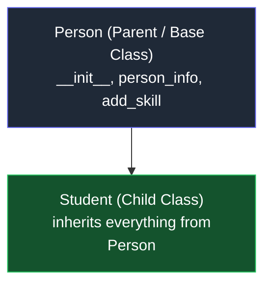

| [⬅️ 10. Recursion](10.%20Recursion.md) | [🏠 Python Index](README.md) |
---

# 📖 Module 11: Classes & Inheritance

<details open>
<summary><b>📋 What You'll Learn</b></summary>

- Understand **objects**, **types**, and the foundation of **Object-Oriented Programming (OOP)**
- Distinguish between **implementing** a class and **using** an instance
- Define **data attributes** and **methods** using the `class` keyword and `__init__`
- Understand the role of **`self`** and **dot notation**
- Visualize how instances are stored and referenced **in memory**
- Recognize the **advantages of OOP**: abstraction, modularity, and reusability
- Build your own **`Coordinate` class** with a custom `distance()` method

</details>

---

## 💡 Objects in Python

Python supports many different kinds of data:

```python
1234           # int
3.14159        # float
"Hello"        # str
[1, 5, 7, 11]  # list
{"CA": "California", "MA": "Massachusetts"}  # dict
```

Each of these is an **object**, and every object has:

- An **internal data representation** (primitive or composite)
- A **set of procedures** for interaction with the object

An object is an **instance of a type**:
- `1234` is an instance of `int`
- `"hello"` is an instance of `str`

---

## ⚙️ Object Oriented Programming (OOP)

> **EVERYTHING IN PYTHON IS AN OBJECT** (and has a type)

| Action | Description |
| :--- | :--- |
| **Create** | Can create new objects of some type |
| **Manipulate** | Can manipulate objects |
| **Destroy** | Can explicitly destroy with `del`, or just "forget" about them |

> [!NOTE]
> Python automatically reclaims destroyed or inaccessible objects — this is called **garbage collection**.

---

## 🔷 What Are Objects?

Objects are a **data abstraction** that captures two things:

### (1) Internal Representation
Through **data attributes** — the variables that live inside the object.

### (2) Interface for Interacting with the Object
Through **methods** (aka procedures/functions) — defines behaviors but **hides implementation**.



### Example: How Lists Work as Objects

**(1) Internal representation** — does not matter much for us as users (private representation):
```
L = 1 -> 2 -> 3 -> 4 ->   (linked list internally)
```

**(2) Interface — how to interact with lists:**
```python
# Indexing & slicing
L[i], L[i:j], L + L2

# Built-in functions
len(L), min(L), max(L), del(L[i])

# Methods
L.append(), L.extend(), L.count(), L.index()
L.insert(), L.pop(), L.remove(), L.reverse(), L.sort()
```

> [!WARNING]
> **Internal representation should be private.** Correct behavior may be compromised if you manipulate the internal representation directly — always go through the interface.

---

## 🌍 Real-Life Examples of Objects

| Object | Internal Representation | Operations |
| :--- | :--- | :--- |
| **Elevator** | `length`, `width`, `height`, `max_capacity`, `current_floor` | Move to a different floor, add/remove people |
| **Employee** | `name`, `birth_date`, `salary` | Change name or salary |
| **Queue at a store** | List of `str` customer names | Append to end, remove from beginning |
| **Stack of pancakes** | List of `str` | Append to end, remove from end |

---

## 🏆 Advantages of OOP

- **Bundle** data into packages together with procedures that work on them through well-defined interfaces
- **Divide-and-conquer development**
  - Implement and test behavior of each class separately
  - Increased modularity reduces complexity
- **Classes make it easy to reuse code**
  - Many Python modules define new classes
  - Each class has a separate environment (no collision on function names)
  - **Inheritance** allows subclasses to redefine or extend a selected subset of a superclass' behavior

---

> [!IMPORTANT]
> ### 💡 Big Idea
> **You write the class, so you make the design decisions.**
> - You decide what **data** represents the class.
> - You decide what **operations** a user can do with the class.

---

## 🏗️ Creating and Using Your Own Types with Classes

Make a distinction between **creating** a class and **using** an instance of the class:

| **Implementing the Class** | **Using the Class** |
| :--- | :--- |
| Defining the class name | Creating new instances of the class |
| Defining class attributes | Doing operations on the instances |
| e.g., someone wrote code to implement a list class | e.g., `L = [1, 2]` and `len(L)` |

### A Parallel with Functions



---

## 📐 Design Decisions: The `Coordinate` Type

Before writing any code, make design decisions:

**What data elements constitute a `Coordinate`?**
- In a 2D plane, a coordinate is defined by an **x** and **y** value

**What operations should a `Coordinate` support?**
- Tell us how far away the coordinate is on the x or y axes
- Measure the **distance** between two coordinates (via Pythagoras)

---

## 🔑 What Are Attributes?

Data and procedures that **"belong" to the class**:

| Attribute Type | Description | Example |
| :--- | :--- | :--- |
| **Data attributes** | Other objects/variables that make up the class | A coordinate is made up of two numbers (`x`, `y`) |
| **Methods** (procedural attributes) | Functions that only work with this class | `distance()` between two coordinate objects |

---

## ✍️ Define Your Own Types

Use the `class` keyword to define a new type:

```python
class Coordinate(object):
    # define attributes here
```

> [!NOTE]
> Similar to `def`, indentation indicates which statements are part of the class definition. The word `object` means `Coordinate` is a Python object and **inherits all its attributes** (more on inheritance later!).

---

## 🔧 Defining How to Create an Instance: `__init__`

Use the special method `__init__` to initialize data attributes:

```python
class Coordinate(object):
    def __init__(self, xval, yval):
        self.x = xval
        self.y = yval
```

- **`self`** allows you to create variables that **belong to this object**
- Without `self`, you are just creating regular local variables!

### 🏠 What is `self`? — The Room Example

Think of the class definition as a **blueprint** with placeholders:

```
Blueprint says:
    self has a chair
    self has a coffee table
    self has a sofa
```

When you create **one instance** (e.g., `living_room`), `self` becomes that actual object:
```
living_room has a blue chair
living_room has a black table
living_room has a white sofa
```

You can make **many instances** using the same blueprint — each with their own values.

> [!IMPORTANT]
> ### 💡 Big Idea
> When **defining** a class, we don't have an actual tangible object yet. **It's only a definition (a blueprint).**

---

## 🚀 Actually Creating an Instance of a Class

```python
c      = Coordinate(3, 4)
origin = Coordinate(0, 0)
```

> [!TIP]
> Don't provide an argument for `self` — Python passes it **automatically**.

**Data attributes** of an instance are called **instance variables**. They are defined with `self.XXX` and accessible with **dot notation** for the lifetime of the object.

```python
print(c.x)       # 3
print(origin.x)  # 0
```

All instances have these data attributes, but with **different values**.

---

## 🔍 Visualizing Instances in Memory

```python
c    = Coordinate(3, 4)
a    = 0
orig = Coordinate(a, a)
```

```
Memory Layout:
┌──────────────────┐    ┌──────────────────┐
│   c              │    │   orig           │
│   Type: Coordinate│    │   Type: Coordinate│
│   x: 3           │    │   x: 0           │
│   y: 4           │    │   y: 0           │
└──────────────────┘    └──────────────────┘

                         a → 0
```

Evaluating `c.x` looks up the structure to which `c` points, then finds the binding for `x` in that structure.

```python
# From the class definition:
class Coordinate(object):
    def __init__(self, xval, yval):
        self.x = xval
        self.y = yval

c      = Coordinate(3, 4)
origin = Coordinate(0, 0)

print(c.x)       # 3
print(origin.x)  # 0
```

---

## ⚡ What Is a Method?

A **method** is a procedural attribute — think of it like a function that works only with this class.

- Python **always passes the object as the first argument**
- Convention is to use **`self`** as the name of the first argument of all methods

### Defining a Method for the `Coordinate` Class

```python
class Coordinate(object):
    def __init__(self, xval, yval):
        self.x = xval
        self.y = yval

    def distance(self, other):
        x_diff_sq = (self.x - other.x) ** 2
        y_diff_sq = (self.y - other.y) ** 2
        return (x_diff_sq + y_diff_sq) ** 0.5
```

> [!NOTE]
> Other than `self` and dot notation, methods behave just like functions — they take params, do operations, and return.

---

## 🎯 How to Call a Method

The **`.` operator** is used to access any attribute — a data attribute or a method.

**Dot notation syntax:**
```
<object_variable>.<method>(<parameters>)
```

This should look familiar!
```python
my_list.append(4)
my_list.sort()
```

### Using the `distance` Method

```python
c    = Coordinate(3, 4)
orig = Coordinate(0, 0)

# Conventional way (dot notation):
print(c.distance(orig))              # 5.0

# Equivalent — explicit class call:
print(Coordinate.distance(c, orig))  # 5.0
```

> [!NOTE]
> `self` becomes the **object you call the method on** (the thing before the dot!). In `c.distance(orig)`, `self` = `c` and `other` = `orig`.

---

## 🔬 Visualizing Method Invocation

```python
c    = Coordinate(3, 4)
orig = Coordinate(0, 0)
c.distance(orig)
```

When Python evaluates `c.distance(orig)`:

1. The **object** is before the dot → `c`
2. Looks up the **type** of `c` → `Coordinate`
3. The method to call is after the dot → `distance`
4. Finds the binding for `distance` in the `Coordinate` class
5. Invokes it with `c` as `self` and `orig` as `other`

```
Memory:
┌────────────────────────────┐
│  Coordinate (class)        │
│  self.x                    │
│  self.y                    │
│  __init__: some code       │
│  distance: some code       │
└────────────────────────────┘

    c                          orig
    Type: Coordinate           Type: Coordinate
    x: 3                       x: 0
    y: 4                       y: 0
```

---

> [!IMPORTANT]
> ### 💡 Big Idea
> **The `.` operator accesses either data attributes or methods.**
> - **Data attributes** are defined with `self.something`
> - **Methods** are functions defined inside the class with `self` as the first parameter

---

## 🔋 The Power of OOP

- **Bundle together** objects that share common attributes and procedures that operate on those attributes
- Use **abstraction** to distinguish between *how to implement* an object vs *how to use* the object
- **Build layers of object abstractions** that inherit behaviors from other classes of objects
- Create our **own classes** of objects on top of Python's basic classes



---

## 🧪 Self-Check Questions & Quizzes

### Question 1: Instance vs. Class 🌟 (Concept Check)

What is the difference between `Coordinate` (the class) and `c = Coordinate(3, 4)` (an instance)?

<details>
<summary><b>💡 Click to Reveal Answer</b></summary>

`Coordinate` is the **blueprint** (definition) — it exists as an object in memory that stores the structure and methods. `c = Coordinate(3, 4)` creates a **new instance** (a tangible object) with its own copy of the data attributes (`x=3`, `y=4`). Many instances can be created from the same class, each with different data values.

</details>

---

### Question 2: The Role of `self` 🔥 (Tricky)

What will this code output, and why?

```python
class Coordinate(object):
    def __init__(self, xval, yval):
        self.x = xval
        self.y = yval

c1 = Coordinate(3, 4)
c2 = Coordinate(10, 10)
c1.x = 99

print(c1.x)
print(c2.x)
```

<details>
<summary><b>💡 Click to Reveal Solution & Explanation</b></summary>

#### ✅ Solution
```text
99
10
```

#### 🔍 Explanation
`self.x` is an **instance variable** — it belongs to that specific instance only. Modifying `c1.x` does not affect `c2.x` because they are separate objects in memory with their own copies of the data attributes. This is a key benefit of OOP: each instance is independent.

</details>

---

### Question 3: Method vs. Function Syntax 💼 (Advanced)

Are these two calls equivalent? Explain what each does.

```python
c    = Coordinate(3, 4)
zero = Coordinate(0, 0)

# Call A
c.distance(zero)

# Call B
Coordinate.distance(c, zero)
```

<details>
<summary><b>💡 Click to Reveal Solution & Explanation</b></summary>

#### ✅ Solution
**Yes, they are exactly equivalent.**

#### 🔍 Explanation
- **Call A** (`c.distance(zero)`): The conventional dot-notation method call. Python automatically passes `c` as `self`.
- **Call B** (`Coordinate.distance(c, zero)`): The explicit form where you call the method directly from the class and manually pass the object `c` as the first argument (`self`).

Both produce the same result: `5.0`. Understanding this equivalence reveals what Python is actually doing under the hood with the `.` operator.

</details>

---

### Question 4: What Does `__init__` Return? 🐛 (Debugging)

A student wrote this code expecting to print the x-coordinate. What's wrong?

```python
class Coordinate(object):
    def __init__(self, xval, yval):
        self.x = xval
        self.y = yval

c = Coordinate.__init__(Coordinate, 3, 4)
print(c.x)
```

<details>
<summary><b>💡 Click to Reveal Solution & Explanation</b></summary>

#### ✅ Solution
This raises an `AttributeError: 'NoneType' object has no attribute 'x'`.

#### 🔍 Explanation
`__init__` is an **initializer**, not a constructor — it always returns `None`. Python's actual instance creation mechanism is `__new__`. When you call `Coordinate(3, 4)`, Python first creates the object in memory, *then* calls `__init__` on it to initialize the attributes.

The correct way is simply:
```python
c = Coordinate(3, 4)
print(c.x)  # 3
```

</details>

---

### Question 5: OOP Design Challenge 🧠 (HOTS)

Design a `Queue` class in Python (first in, first out). Define:
- What data will represent the queue?
- What methods will it have?
- Write the class with at least `enqueue()`, `dequeue()`, and `is_empty()` methods.

<details>
<summary><b>💡 Click to Reveal Solution & Explanation</b></summary>

#### ✅ Solution

```python
class Queue(object):
    def __init__(self):
        self.customers = []  # Internal representation: a list of names

    def enqueue(self, name):
        """Add a customer to the end of the queue."""
        self.customers.append(name)

    def dequeue(self):
        """Remove and return the first customer in the queue."""
        if self.is_empty():
            return None
        return self.customers.pop(0)

    def is_empty(self):
        """Return True if there are no customers waiting."""
        return len(self.customers) == 0

    def size(self):
        """Return the number of customers in the queue."""
        return len(self.customers)


# Using the class:
q = Queue()
q.enqueue("Alice")
q.enqueue("Bob")
q.enqueue("Charlie")

print(q.dequeue())   # Alice (first in, first out)
print(q.size())      # 2
print(q.is_empty())  # False
```

#### 🔍 Explanation
- **Data**: `self.customers` is a list (private internal representation)
- **Interface**: `enqueue()`, `dequeue()`, `is_empty()`, `size()` are the methods
- Users never need to know *how* `customers` is stored internally — that is abstraction!

</details>

---

## 🔑 Key Takeaways

| Concept | Key Point |
| :--- | :--- |
| **Object** | Every Python value is an object with an internal representation and an interface |
| **Class** | A blueprint/definition — not a tangible object until instantiated |
| **Instance** | A concrete object created from a class, with its own copy of data attributes |
| **`__init__`** | The initializer method that sets up instance variables when an object is created |
| **`self`** | Refers to the current instance; Python passes it automatically on method calls |
| **Dot notation** | Used to access both data attributes (`c.x`) and methods (`c.distance(orig)`) |
| **Data attribute** | A variable bound to an instance via `self.something` |
| **Method** | A function defined inside a class with `self` as the first parameter |
| **Abstraction** | Hides internal representation; users only interact through the defined interface |
| **OOP Advantage** | Modularity, reusability, and divide-and-conquer development |

---

---

## 📘 Lecture 18: More Python Class Methods

---

## 🔄 Two Perspectives: Implementing vs. Using a Class

When working with classes in Python, always think from **two different perspectives**:

| **Implementing the Class** | **Using the Class** |
| :--- | :--- |
| Define the class | Create instances of the object type |
| Define **data attributes** (WHAT IS the object) | Do operations with instances |
| Define **methods** (HOW TO use the object) | Instances have specific values for attributes |
| Class abstractly captures common properties & behaviors | |

---

## 🔁 Recall: The `Coordinate` Class

The class definition tells Python the **blueprint** for a type `Coordinate`:

```python
class Coordinate(object):
    """ A coordinate made up of an x and y value """
    def __init__(self, x, y):
        """ Sets the x and y values """
        self.x = x
        self.y = y

    def distance(self, other):
        """ Returns euclidean dist between two Coord obj """
        x_diff_sq = (self.x - other.x) ** 2
        y_diff_sq = (self.y - other.y) ** 2
        return (x_diff_sq + y_diff_sq) ** 0.5
```

---

## ➕ Adding More Methods to a Class

Methods are functions that only work with objects of this type. You can keep adding them to the class:

```python
class Coordinate(object):
    """ A coordinate made up of an x and y value """
    def __init__(self, x, y):
        self.x = x
        self.y = y

    def distance(self, other):
        """ Returns euclidean dist between two Coord obj """
        x_diff_sq = (self.x - other.x) ** 2
        y_diff_sq = (self.y - other.y) ** 2
        return (x_diff_sq + y_diff_sq) ** 0.5

    def to_origin(self):
        """ Always sets self.x and self.y to 0, 0 """
        self.x = 0
        self.y = 0
```

### Using the Extended Class

```python
c      = Coordinate(3, 4)
origin = Coordinate(0, 0)

print(f"c's x is {c.x} and origin's x is {origin.x}")
print(c.distance(origin))

c.to_origin()
print(c.x, c.y)   # 0 0
```

---

## 🆚 Class Definition vs. Instance of a Class

| **Class Definition** | **Instance of a Class** |
| :--- | :--- |
| Class name is the type: `class Coordinate(object)` | One specific object: `coord = Coordinate(1, 2)` |
| Defined generically using `self` | Data attribute values vary between instances |
| `self` is a parameter to methods in the class definition | `c1 = Coordinate(1,2)` and `c2 = Coordinate(3,4)` have different `c1.x` vs `c2.x` |
| Defines data and methods **common across all instances** | Instance has the **structure** of the class |

---

## 🏗️ Using Classes to Build Other Classes

You can use one class as a building block for another.

**Example**: Use `Coordinate` to build a `Circle`



Our `Circle` will have **2 data attributes**:
- A `Coordinate` object representing the **center**
- An `int` representing the **radius**

### `Circle` Class: Definition and Instances

```python
class Circle(object):
    def __init__(self, center, radius):
        self.center = center
        self.radius = radius

center    = Coordinate(2, 2)
my_circle = Circle(center, 2)
```

### Adding an `is_inside` Method

```python
class Circle(object):
    def __init__(self, center, radius):
        self.center = center
        self.radius = radius

    def is_inside(self, point):
        """ Returns True if point is in self, False otherwise """
        return point.distance(self.center) < self.radius

center    = Coordinate(2, 2)
my_circle = Circle(center, 2)
p         = Coordinate(1, 1)

print(my_circle.is_inside(p))   # True
```

> [!TIP]
> ### ✏️ You Try It! — Input Validation
> Add code to the `__init__` method to check that `center` is a `Coordinate` object and `radius` is an `int`. If either is wrong, raise a `ValueError`.
> ```python
> def __init__(self, center, radius):
>     self.center = center
>     self.radius = radius
> ```

> [!NOTE]
> ### ✏️ You Try It! — Are These Equivalent?
> Are these two methods in the `Circle` class functionally equivalent?
> ```python
> def is_inside1(self, point):
>     return point.distance(self.center) < self.radius
>
> def is_inside2(self, point):
>     return self.center.distance(point) < self.radius
> ```
> **Answer:** Yes — `distance()` is symmetric: `point.distance(center) == center.distance(point)`.

---

## 🔢 Example: The `SimpleFraction` Class

Create a new type to represent a number as a fraction.

- **Internal representation**: two integers — numerator and denominator
- **Interface (methods)**: multiply, add, invert

### Step 1: Create Instances

```python
class SimpleFraction(object):
    def __init__(self, n, d):
        self.num   = n
        self.denom = d
```

### Step 2: Multiply Fractions

```python
def times(self, oth):
    top    = self.num   * oth.num
    bottom = self.denom * oth.denom
    return top / bottom
```

### Step 3: Add Fractions

```python
def plus(self, oth):
    top    = self.num * oth.denom + self.denom * oth.num
    bottom = self.denom * oth.denom
    return top / bottom
```

### Trying It Out

```python
f1 = SimpleFraction(3, 4)
f2 = SimpleFraction(1, 4)

print(f1.num)          # 3
print(f1.denom)        # 4
print(f1.plus(f2))     # 1.0
print(f1.times(f2))    # 0.1875
```

> [!TIP]
> ### ✏️ You Try It! — Invert Methods
> Add two methods to invert a `SimpleFraction` object:
> ```python
> def get_inverse(self):
>     """ Returns a float representing 1/self """
>     pass
>
> def invert(self):
>     """ Sets self's num to denom and vice versa. Returns None. """
>     pass
>
> # Example:
> f1 = SimpleFraction(3, 4)
> print(f1.get_inverse())   # 1.3333...  (returns a value)
> f1.invert()               # modifies in place, no return
> print(f1.num, f1.denom)   # 4 3
> ```

---

## 🪄 Dunder Methods (Special Operators)

When you try to `print` a custom object or use `*` with it, you get unexpected results:

```python
f1 = SimpleFraction(3, 4)
f2 = SimpleFraction(1, 4)

print(f1)       # <__main__.SimpleFraction object at 0x00000234A8C41DF0>
print(f1 * f2)  # Error!
```

That's because Python uses **special (dunder) methods** behind the scenes for every common operation. You can **override** these to work with your own class.

> [!IMPORTANT]
> ### 💡 Big Idea
> **Special operations we've been using are just methods behind the scenes.**
> Things like `print`, `len`, `+`, `*`, `-`, `/`, `<`, `>`, `<=`, `>=`, `==`, `!=`, `[]` — and many others — are all just method calls!

### Full Dunder Method Reference

| Dunder Method | Operator / Function |
| :--- | :---: |
| `__add__(self, other)` | `self + other` |
| `__sub__(self, other)` | `self - other` |
| `__mul__(self, other)` | `self * other` |
| `__truediv__(self, other)` | `self / other` |
| `__eq__(self, other)` | `self == other` |
| `__lt__(self, other)` | `self < other` |
| `__len__(self)` | `len(self)` |
| `__str__(self)` | `print(self)` |
| `__float__(self)` | `float(self)` |
| `__pow__(self, other)` | `self ** other` |

> [!NOTE]
> Full list: [Python Data Model — Basic Customization](https://docs.python.org/3/reference/datamodel.html#basic-customization)

---

## 🖨️ Print Representation of an Object: `__str__`

By default, printing a custom object is uninformative:

```python
c = Coordinate(3, 4)
print(c)
# <__main__.Coordinate object at 0x7fa918510488>
```

Define `__str__` to control how the object is printed:

```python
class Coordinate(object):
    def __init__(self, xval, yval):
        self.x = xval
        self.y = yval

    def distance(self, other):
        x_diff_sq = (self.x - other.x) ** 2
        y_diff_sq = (self.y - other.y) ** 2
        return (x_diff_sq + y_diff_sq) ** 0.5

    def __str__(self):
        return "<" + str(self.x) + "," + str(self.y) + ">"
```

```python
c = Coordinate(3, 4)
print(c)          # <3,4>
```

---

## 🔍 Types, Classes, and `isinstance()`

```python
c = Coordinate(3, 4)

print(c)                        # <3,4>
print(type(c))                  # <class '__main__.Coordinate'>
print(Coordinate)               # <class '__main__.Coordinate'>
print(type(Coordinate))         # <class 'type'>
print(isinstance(c, Coordinate))  # True
```

- `type(c)` → the class the instance belongs to
- `type(Coordinate)` → `type` (all classes are themselves instances of `type`)
- `isinstance(c, Coordinate)` → the preferred way to check if an object is a specific type

---

## 🔢 Full `Fraction` Class with Dunder Methods

Now let's build a proper `Fraction` class using dunder methods instead of plain methods.

### Step 1: Create & Print Instances

```python
class Fraction(object):
    def __init__(self, n, d):
        self.num   = n
        self.denom = d

    def __str__(self):
        return str(self.num) + "/" + str(self.denom)
```

```python
f1 = Fraction(3, 4)
f2 = Fraction(1, 4)
f3 = Fraction(5, 1)

print(f1)   # 3/4
print(f2)   # 1/4
print(f3)   # 5/1  ← looks a bit weird, we can fix this!
```

> [!TIP]
> ### ✏️ You Try It! — Smarter `__str__`
> Modify `__str__` so that when the denominator is `1`, it prints only the numerator:
> ```python
> a = Fraction(1, 4)
> b = Fraction(3, 1)
> print(a)   # 1/4
> print(b)   # 3
> ```

### Step 2: Comparing `times` vs. `__mul__`

```python
# SimpleFraction — plain method
def times(self, oth):
    top    = self.num   * oth.num
    bottom = self.denom * oth.denom
    return top / bottom             # returns a float

# Fraction — dunder method
def __mul__(self, other):
    top    = self.num   * other.num
    bottom = self.denom * other.denom
    return Fraction(top, bottom)    # returns a new Fraction object!
```

```python
a = Fraction(1, 4)
b = Fraction(3, 4)
print(a)        # 1/4
c = a * b
print(c)        # 3/16
```

### Abstraction at Work

All three of these are **equivalent**:

```python
print(a * b)
print(a.__mul__(b))
print(Fraction.__mul__(a, b))
```

> [!IMPORTANT]
> The first form (`a * b`) makes the operation **clear without exposing internal details** — that's abstraction at work!

### Step 3: Add `__float__` to Cast to Float

```python
def __float__(self):
    return self.num / self.denom

c = a * b
print(c)          # 3/16
print(float(c))   # 0.1875
```

---

## 🔻 Reducing Fractions: The `reduce()` Method

```python
a = Fraction(1, 4)
b = Fraction(2, 3)
c = a * b
print(c)          # 2/12  ← not reduced!
```

Add a `reduce()` method using GCD:

```python
class Fraction(object):
    # ...
    def reduce(self):
        def gcd(n, d):
            while d != 0:
                (d, n) = (n % d, d)
            return n

        if self.denom == 0:
            return None
        elif self.denom == 1:
            return self.num          # ⚠️ returns int, not Fraction!
        else:
            greatest_common_divisor = gcd(self.num, self.denom)
            top    = int(self.num   / greatest_common_divisor)
            bottom = int(self.denom / greatest_common_divisor)
            return Fraction(top, bottom)
```

```python
c = a * b
print(c)            # 2/12
print(c.reduce())   # 1/6
```

### 🐛 Bug: Inconsistent Return Types

```python
a  = Fraction(4, 1)
b  = Fraction(3, 9)
ar = a.reduce()
br = b.reduce()

print(ar, type(ar))   # 4   <class 'int'>
print(br, type(br))   # 1/3 <class '__main__.Fraction'>

c = ar * br           # Error! int has no __mul__ that accepts Fraction
```

The `reduce()` method returns an `int` when `denom == 1` but a `Fraction` otherwise — **inconsistent types cause bugs!**

> [!TIP]
> ### ✏️ You Try It! — Fix `reduce()`
> Modify `reduce()` to always return a `Fraction` object, even when the denominator is 1:
> ```python
> elif self.denom == 1:
>     return self.num   # ← fix this line!
>
> # Example:
> f1 = Fraction(5, 1)
> print(f1.reduce())   # should print 5/1, not 5
> ```
> **Fix:** Replace `return self.num` with `return Fraction(self.num, 1)`

---

## 🏆 Why OOP? — Summary

- **Code is organized and modular** — each class handles its own behavior
- **Code is easy to maintain** — changes are localized to the class
- **Easy to build upon** — use objects as building blocks for more complex objects
- **Decomposition and abstraction** at work with Python classes
- **Bundling data and behaviors** means you can use objects consistently
- **Dunder methods** are abstracted by common operations — but they're just methods behind the scenes!

---

## 🧪 Self-Check Questions & Quizzes (Lecture 18)

### Question 6: `__str__` vs. `print` 💼 (Advanced)

What is the difference between these two calls, and which one triggers `__str__`?

```python
c = Coordinate(3, 4)
print(c)
str(c)
```

<details>
<summary><b>💡 Click to Reveal Solution & Explanation</b></summary>

#### ✅ Solution
Both `print(c)` and `str(c)` trigger the `__str__` method.

#### 🔍 Explanation
- `print(c)` internally calls `str(c)` and then outputs the result.
- `str(c)` directly calls `c.__str__()` and returns the string.
- So both are equivalent in that both invoke `__str__`, but `str(c)` gives you the string back as a value while `print(c)` outputs it to the console.

</details>

---

### Question 7: Dunder or Plain Method? 🔥 (Tricky)

What does this code output?

```python
class Fraction(object):
    def __init__(self, n, d):
        self.num   = n
        self.denom = d
    def __str__(self):
        return str(self.num) + "/" + str(self.denom)
    def __mul__(self, other):
        top    = self.num   * other.num
        bottom = self.denom * other.denom
        return Fraction(top, bottom)

a = Fraction(1, 2)
b = Fraction(3, 4)
print(a.__mul__(b))
print(Fraction.__mul__(a, b))
print(a * b)
```

<details>
<summary><b>💡 Click to Reveal Solution & Explanation</b></summary>

#### ✅ Solution
```text
3/8
3/8
3/8
```

#### 🔍 Explanation
All three calls are **exactly equivalent**. Python's `a * b` syntax is just syntactic sugar — the interpreter transforms it into `a.__mul__(b)` or `type(a).__mul__(a, b)` under the hood. This is the core concept of dunder methods: **common operators are just method calls in disguise**.

</details>

---

### Question 8: Return Type Consistency 🐛 (Debugging)

A student wrote this `reduce()` method for the `Fraction` class. Identify the bug and fix it.

```python
def reduce(self):
    def gcd(n, d):
        while d != 0:
            (d, n) = (n % d, d)
        return n
    if self.denom == 0:
        return None
    elif self.denom == 1:
        return self.num           # Bug here!
    else:
        g      = gcd(self.num, self.denom)
        top    = int(self.num   / g)
        bottom = int(self.denom / g)
        return Fraction(top, bottom)
```

<details>
<summary><b>💡 Click to Reveal Solution & Explanation</b></summary>

#### ✅ Bug
`return self.num` returns a plain `int`, while all other paths return a `Fraction`.

#### ✅ Fix
```python
elif self.denom == 1:
    return Fraction(self.num, 1)   # Always return a Fraction
```

#### 🔍 Explanation
**Consistency of return types** is crucial in OOP. If callers expect a `Fraction` object (to call `.num`, `.denom`, or dunder methods on it), returning an `int` breaks their code. Always make sure all branches of a method return the **same type**.

</details>

---

### Question 9: `isinstance()` Deep Dive 🧠 (HOTS)

What does each line print, and why?

```python
class Coordinate(object):
    def __init__(self, x, y):
        self.x = x
        self.y = y

c = Coordinate(3, 4)

print(isinstance(c, Coordinate))   # Line 1
print(isinstance(c, object))       # Line 2
print(isinstance(Coordinate, type))  # Line 3
```

<details>
<summary><b>💡 Click to Reveal Solution & Explanation</b></summary>

#### ✅ Solution
```text
True
True
True
```

#### 🔍 Explanation
1. `isinstance(c, Coordinate)` → `True`. `c` is an instance of `Coordinate`.
2. `isinstance(c, object)` → `True`. **Every** Python class inherits from `object`, so every instance is also an instance of `object`.
3. `isinstance(Coordinate, type)` → `True`. The class `Coordinate` itself is an object, and its type is `type` — the metaclass of all classes in Python. This is why `type(Coordinate)` returns `<class 'type'>`.

</details>

---

### Question 10: Building Classes from Classes 🧠 (HOTS)

Given the `Coordinate` and `Circle` classes, what does this code print?

```python
class Circle(object):
    def __init__(self, center, radius):
        self.center = center
        self.radius = radius
    def is_inside(self, point):
        return point.distance(self.center) < self.radius

center = Coordinate(0, 0)
c1     = Circle(center, 5)
p1     = Coordinate(3, 4)
p2     = Coordinate(4, 4)

print(c1.is_inside(p1))
print(c1.is_inside(p2))
```

<details>
<summary><b>💡 Click to Reveal Solution & Explanation</b></summary>

#### ✅ Solution
```text
True
False
```

#### 🔍 Explanation
- `p1 = (3, 4)`: distance from origin = `√(9 + 16)` = `√25` = `5.0`. This is **not less than** 5 → `False`...

  Wait — `5.0 < 5` is `False`. So actually `p1` is **exactly** on the boundary, and `is_inside` uses strict `<`. Let's recalculate:
  - `p1.distance(center)` = 5.0, and `5.0 < 5` = `False`.
  - `p2.distance(center)` = `√(16 + 16)` = `√32` ≈ `5.66`, and `5.66 < 5` = `False`.

  **Corrected output:**
  ```text
  False
  False
  ```

  > **Key lesson:** Points exactly on the boundary are **not** considered inside with strict `<`. Use `<=` for "on or inside."

</details>

---

## 🔑 Key Takeaways (Lecture 18)

| Concept | Key Point |
| :--- | :--- |
| **Adding methods** | You can keep extending a class with new methods at any time |
| **Classes using classes** | One class can hold another class as a data attribute (composition) |
| **Dunder methods** | Special methods like `__str__`, `__mul__`, `__float__` let your class work with built-in Python operators |
| **`__str__`** | Called automatically by `print()` and `str()` — define it to control your object's display |
| **`__mul__` vs `.times()`** | Dunder version (`*`) is cleaner and hides implementation — abstraction in action |
| **Return type consistency** | All paths in a method should return the same type to avoid bugs |
| **`isinstance()`** | Preferred way to check an object's type — also catches inheritance relationships |
| **Why OOP?** | Organized, modular, maintainable code; easy to compose complex objects from simpler ones |

---

---

## 📗 30 Days of Python — Day 21: Classes and Objects

---

## 💡 Everything in Python is an Object

Every element in a Python program is an object of a class — you've been using classes from Day 1!

```python
num     = 10;    type(num)     # <class 'int'>
string  = 'hi';  type(string)  # <class 'str'>
boolean = True;  type(boolean) # <class 'bool'>
lst     = [];    type(lst)     # <class 'list'>
tpl     = ();    type(tpl)     # <class 'tuple'>
set1    = set(); type(set1)    # <class 'set'>
dct     = {};    type(dct)     # <class 'dict'>
```

A **class** is like an object constructor — a *blueprint* for creating objects. We **instantiate** a class to create an **object**.



---

## ✍️ Creating a Class

Use the `class` keyword followed by a **CamelCase** name and a colon:

```python
# Syntax
class ClassName:
    code goes here
```

```python
class Person:
    pass

print(Person)
# <class '__main__.Person'>
```

---

## 🏗️ Creating an Object

Create an object by **calling** the class like a function:

```python
p = Person()
print(p)
# <__main__.Person object at 0x10804e510>
```

> [!NOTE]
> A class without a constructor is not very useful in real applications. The next step is to add `__init__`.

---

## 🔧 Class Constructor: `__init__`

Python's built-in `__init__()` constructor function runs automatically when an object is created. The `self` parameter is a reference to the **current instance** of the class.

### Basic Constructor

```python
class Person:
    def __init__(self, name):
        self.name = name   # attach parameter to the instance

p = Person('Asabeneh')
print(p.name)   # Asabeneh
print(p)        # <__main__.Person object at 0x2abf46907e80>
```

### Constructor with Multiple Parameters

```python
class Person:
    def __init__(self, firstname, lastname, age, country, city):
        self.firstname = firstname
        self.lastname  = lastname
        self.age       = age
        self.country   = country
        self.city      = city

p = Person('Asabeneh', 'Yetayeh', 250, 'Finland', 'Helsinki')
print(p.firstname)   # Asabeneh
print(p.lastname)    # Yetayeh
print(p.age)         # 250
print(p.country)     # Finland
print(p.city)        # Helsinki
```

---

## ⚡ Object Methods

Objects can have **methods** — functions that belong to the object and operate on its data:

```python
class Person:
    def __init__(self, firstname, lastname, age, country, city):
        self.firstname = firstname
        self.lastname  = lastname
        self.age       = age
        self.country   = country
        self.city      = city

    def person_info(self):
        return (f'{self.firstname} {self.lastname} is {self.age} years old. '
                f'He lives in {self.city}, {self.country}.')

p = Person('Asabeneh', 'Yetayeh', 250, 'Finland', 'Helsinki')
print(p.person_info())
# Asabeneh Yetayeh is 250 years old. He lives in Helsinki, Finland.
```

---

## 🔵 Object Default Methods

Give constructor parameters **default values** so the class can be instantiated without arguments:

```python
class Person:
    def __init__(self, firstname='Asabeneh', lastname='Yetayeh',
                 age=250, country='Finland', city='Helsinki'):
        self.firstname = firstname
        self.lastname  = lastname
        self.age       = age
        self.country   = country
        self.city      = city

    def person_info(self):
        return (f'{self.firstname} {self.lastname} is {self.age} years old. '
                f'He lives in {self.city}, {self.country}.')

p1 = Person()                                             # uses all defaults
p2 = Person('John', 'Doe', 30, 'Nomanland', 'Noman city')

print(p1.person_info())
# Asabeneh Yetayeh is 250 years old. He lives in Helsinki, Finland.
print(p2.person_info())
# John Doe is 30 years old. He lives in Noman city, Nomanland.
```

> [!TIP]
> Default values let you call the constructor with **zero, some, or all** arguments — very useful for testing and prototyping.

---

## 🛠️ Method to Modify Class Default Values

Add a method that **mutates** an instance's data attributes. Here, `add_skill()` appends to a list stored on the object:

```python
class Person:
    def __init__(self, firstname='Asabeneh', lastname='Yetayeh',
                 age=250, country='Finland', city='Helsinki'):
        self.firstname = firstname
        self.lastname  = lastname
        self.age       = age
        self.country   = country
        self.city      = city
        self.skills    = []          # starts empty for every new instance

    def person_info(self):
        return (f'{self.firstname} {self.lastname} is {self.age} years old. '
                f'He lives in {self.city}, {self.country}.')

    def add_skill(self, skill):
        self.skills.append(skill)

p1 = Person()
p1.add_skill('HTML')
p1.add_skill('CSS')
p1.add_skill('JavaScript')

p2 = Person('John', 'Doe', 30, 'Nomanland', 'Noman city')

print(p1.person_info())   # Asabeneh Yetayeh is 250 years old...
print(p2.person_info())   # John Doe is 30 years old...
print(p1.skills)          # ['HTML', 'CSS', 'JavaScript']
print(p2.skills)          # []
```

> [!NOTE]
> Each instance gets its **own** `skills` list. `p2.skills` is still empty even though `p1` added skills — instances do not share mutable data attributes.

---

## 🧬 Inheritance

Inheritance lets a **child class** reuse all methods and properties from a **parent class**, while optionally adding new ones or overriding existing ones.



### Simple Inheritance (no new `__init__`)

```python
class Student(Person):
    pass

s1 = Student('Eyob',   'Yetayeh',     30, 'Finland', 'Helsinki')
s2 = Student('Lidiya', 'Teklemariam', 28, 'Finland', 'Espoo')

print(s1.person_info())     # Eyob Yetayeh is 30 years old. He lives in Helsinki, Finland.
s1.add_skill('JavaScript')
s1.add_skill('React')
s1.add_skill('Python')
print(s1.skills)            # ['JavaScript', 'React', 'Python']

print(s2.person_info())     # Lidiya Teklemariam is 28 years old. He lives in Espoo, Finland.
s2.add_skill('Organizing')
s2.add_skill('Marketing')
s2.add_skill('Digital Marketing')
print(s2.skills)            # ['Organizing', 'Marketing', 'Digital Marketing']
```

> [!NOTE]
> Because `Student` has no `__init__`, it **inherits** the parent's `__init__` automatically. All of `Person`'s methods are available on `Student` instances.

---

## 🔄 Overriding a Parent Method

When you define a method in the child class **with the same name** as one in the parent, the child's version **overrides** it.

Use **`super()`** to call the parent's `__init__` from inside the child's `__init__`, so you still get all the parent's attributes:

```python
class Student(Person):
    def __init__(self, firstname='Asabeneh', lastname='Yetayeh',
                 age=250, country='Finland', city='Helsinki', gender='male'):
        self.gender = gender
        super().__init__(firstname, lastname, age, country, city)

    def person_info(self):
        pronoun = 'He' if self.gender == 'male' else 'She'
        return (f'{self.firstname} {self.lastname} is {self.age} years old. '
                f'{pronoun} lives in {self.city}, {self.country}.')

s1 = Student('Eyob',   'Yetayeh',     30, 'Finland', 'Helsinki', 'male')
s2 = Student('Lidiya', 'Teklemariam', 28, 'Finland', 'Espoo',    'female')

print(s1.person_info())
# Eyob Yetayeh is 30 years old. He lives in Helsinki, Finland.

s1.add_skill('JavaScript')
s1.add_skill('React')
s1.add_skill('Python')
print(s1.skills)
# ['JavaScript', 'React', 'Python']

print(s2.person_info())
# Lidiya Teklemariam is 28 years old. She lives in Espoo, Finland.

s2.add_skill('Organizing')
s2.add_skill('Marketing')
s2.add_skill('Digital Marketing')
print(s2.skills)
# ['Organizing', 'Marketing', 'Digital Marketing']
```

### `super()` Explained

| Without `super()` | With `super()` |
| :--- | :--- |
| Child's `__init__` completely replaces parent's | Child's `__init__` extends parent's |
| Must redefine all parent attributes manually | Parent attributes set up automatically |
| More repetitive code | DRY (Don't Repeat Yourself) |

```python
# super().__init__(...) is equivalent to:
Person.__init__(self, firstname, lastname, age, country, city)
```

---

## 🏛️ Full Inheritance Summary

```mermaid
flowchart TD
    A["Person\nfirstname, lastname, age, country, city, skills\nperson_info(), add_skill()"]
    B["Student\n+ gender\nperson_info() ← overrides parent"]
    A -->|inherits| B
    B -->|super().__init__| A
    style A fill:#1f2937,stroke:#6366f1,color:#fff
    style B fill:#14532d,stroke:#22c55e,color:#fff
```

| Concept | Description |
| :--- | :--- |
| **Parent / Base / Super class** | The class being inherited from — gives all methods and properties |
| **Child / Sub class** | The class that inherits — can add new methods or override inherited ones |
| **`super()`** | Built-in function to call the parent class's methods from the child |
| **Method Overriding** | Defining the same method name in the child replaces the parent's version |
| **`pass`** | Use in a child class body when you want to inherit everything without any changes |

---

## 🧪 Self-Check Questions & Quizzes (Day 21)

### Question 11: Inheritance Chain 🌟 (Concept Check)

Why does `Student` (with `pass` only) still have access to `person_info()` and `add_skill()`?

<details>
<summary><b>💡 Click to Reveal Answer</b></summary>

Because `class Student(Person)` declares that `Student` **inherits** from `Person`. Python's Method Resolution Order (MRO) searches the child class first, then the parent class, so every method defined in `Person` is automatically available on `Student` instances — no extra code needed.

</details>

---

### Question 12: Mutable Default — The Hidden Trap 🔥 (Tricky)

What is wrong with this class? What bug will appear after creating two instances?

```python
class Person:
    def __init__(self):
        self.skills = []      # Is this fine?

p1 = Person()
p2 = Person()
p1.skills.append('Python')
print(p2.skills)              # What prints here?
```

<details>
<summary><b>💡 Click to Reveal Solution & Explanation</b></summary>

#### ✅ Solution
```text
[]
```

#### 🔍 Explanation
In this case the code is **actually correct** — `self.skills = []` inside `__init__` creates a **new, independent list** for every instance. So `p1.skills` and `p2.skills` are separate objects.

The classic Python trap occurs when you put a mutable default at the **class level**:
```python
class Person:
    skills = []   # ← shared across ALL instances!

p1 = Person()
p2 = Person()
p1.skills.append('Python')
print(p2.skills)   # ['Python'] — bug!
```
Always initialize mutable data attributes (lists, dicts) inside `__init__`, never at class level.

</details>

---

### Question 13: `super()` vs. Not Using It 💼 (Advanced)

What is the difference between these two `Student` definitions?

```python
# Version A
class Student(Person):
    def __init__(self, firstname, lastname, age, country, city, gender):
        self.gender    = gender
        self.firstname = firstname
        self.lastname  = lastname
        self.age       = age
        self.country   = country
        self.city      = city
        self.skills    = []

# Version B
class Student(Person):
    def __init__(self, firstname, lastname, age, country, city, gender):
        self.gender = gender
        super().__init__(firstname, lastname, age, country, city)
```

<details>
<summary><b>💡 Click to Reveal Solution & Explanation</b></summary>

#### ✅ Solution
Both versions produce the same result **right now**, but **Version B is far better** in practice.

#### 🔍 Explanation
- **Version A** manually redefines every parent attribute. If you later add `email` to `Person.__init__`, you must also update every child class manually — violating the **DRY principle**.
- **Version B** calls `super().__init__()`, so `Student` automatically benefits from any future changes to `Person.__init__`. This is the standard, correct pattern for inheritance.

</details>

---

### Question 14: Method Override — Output Prediction 🐛 (Debugging)

What does this code print?

```python
class Animal:
    def speak(self):
        return "..."

class Dog(Animal):
    def speak(self):
        return "Woof!"

class Cat(Animal):
    pass

d = Dog()
c = Cat()
print(d.speak())
print(c.speak())
```

<details>
<summary><b>💡 Click to Reveal Solution & Explanation</b></summary>

#### ✅ Solution
```text
Woof!
...
```

#### 🔍 Explanation
- `Dog` **overrides** `speak()`, so `d.speak()` uses `Dog`'s version → `"Woof!"`
- `Cat` has `pass` and does **not** override `speak()`, so `c.speak()` falls back to `Animal`'s version → `"..."`

This demonstrates that method overriding only affects the class where you define the new method — sibling classes are unaffected.

</details>

---

### Question 15: Statistics Class Design 🧠 (HOTS — Level 1 Exercise)

Implement the `Statistics` class from the Day 21 exercise. Given a list of ages, all methods should work as shown:

```python
ages = [31, 26, 34, 37, 27, 26, 32, 32, 26, 27, 27, 24, 32, 33, 27, 25, 26, 38, 37, 31, 34, 24, 33, 29, 26]
data = Statistics(ages)
print('Count:',                 data.count())     # 25
print('Sum:',                   data.sum())       # 744
print('Min:',                   data.min())       # 24
print('Max:',                   data.max())       # 38
print('Range:',                 data.range())     # 14
print('Mean:',                  data.mean())      # 30
print('Median:',                data.median())    # 29
print('Mode:',                  data.mode())      # (26, 5)
print('Variance:',              data.var())       # 17.5
print('Standard Deviation:',    data.std())       # 4.2
print('Frequency Distribution:',data.freq_dist())
```

<details>
<summary><b>💡 Click to Reveal Solution & Explanation</b></summary>

#### ✅ Solution

```python
class Statistics:
    def __init__(self, data):
        self.data = sorted(data)

    def count(self):
        return len(self.data)

    def sum(self):
        return sum(self.data)

    def min(self):
        return self.data[0]

    def max(self):
        return self.data[-1]

    def range(self):
        return self.max() - self.min()

    def mean(self):
        return round(self.sum() / self.count())

    def median(self):
        n   = self.count()
        mid = n // 2
        if n % 2 == 0:
            return (self.data[mid - 1] + self.data[mid]) / 2
        return self.data[mid]

    def mode(self):
        frequency = {}
        for val in self.data:
            frequency[val] = frequency.get(val, 0) + 1
        max_count = max(frequency.values())
        mode_val  = max(frequency, key=frequency.get)
        return (mode_val, max_count)

    def var(self):
        mu  = self.sum() / self.count()
        var = sum((x - mu) ** 2 for x in self.data) / self.count()
        return round(var, 1)

    def std(self):
        return round(self.var() ** 0.5, 1)

    def freq_dist(self):
        frequency = {}
        for val in self.data:
            frequency[val] = frequency.get(val, 0) + 1
        n = self.count()
        return sorted(
            [(round(count / n * 100, 1), val) for val, count in frequency.items()],
            reverse=True
        )

    def describe(self):
        print('Count:', self.count())
        print('Sum: ', self.sum())
        print('Min: ', self.min())
        print('Max: ', self.max())
        print('Range: ', self.range())
        print('Mean: ', self.mean())
        print('Median: ', self.median())
        print('Mode: ', self.mode())
        print('Variance: ', self.var())
        print('Standard Deviation: ', self.std())
        print('Frequency Distribution:', self.freq_dist())

# Usage
ages = [31, 26, 34, 37, 27, 26, 32, 32, 26, 27, 27,
        24, 32, 33, 27, 25, 26, 38, 37, 31, 34, 24, 33, 29, 26]
data = Statistics(ages)
data.describe()
```

#### 🔍 Key Design Points
- `__init__` sorts the data immediately — simplifies `min`, `max`, and `median`
- All methods call each other (e.g., `mean()` calls `sum()` and `count()`) to stay DRY
- `freq_dist()` returns a list of `(percentage, value)` tuples sorted by frequency

</details>

---

### Question 16: `PersonAccount` Class 🧠 (HOTS — Level 2 Exercise)

Design a `PersonAccount` class with:
- **Data attributes**: `firstname`, `lastname`, `incomes` (list), `expenses` (list)
- **Methods**: `add_income`, `add_expense`, `total_income`, `total_expense`, `account_balance`, `account_info`

<details>
<summary><b>💡 Click to Reveal Solution & Explanation</b></summary>

#### ✅ Solution

```python
class PersonAccount:
    def __init__(self, firstname, lastname):
        self.firstname = firstname
        self.lastname  = lastname
        self.incomes   = []   # list of (amount, description) tuples
        self.expenses  = []   # list of (amount, description) tuples

    def add_income(self, amount, description):
        self.incomes.append((amount, description))

    def add_expense(self, amount, description):
        self.expenses.append((amount, description))

    def total_income(self):
        return sum(amount for amount, _ in self.incomes)

    def total_expense(self):
        return sum(amount for amount, _ in self.expenses)

    def account_balance(self):
        return self.total_income() - self.total_expense()

    def account_info(self):
        return (f'{self.firstname} {self.lastname}\n'
                f'  Total Income:  ${self.total_income():,.2f}\n'
                f'  Total Expense: ${self.total_expense():,.2f}\n'
                f'  Balance:       ${self.account_balance():,.2f}')

# Usage
acc = PersonAccount('Asabeneh', 'Yetayeh')
acc.add_income(5000,  'Salary')
acc.add_income(1200,  'Freelance')
acc.add_expense(800,  'Rent')
acc.add_expense(200,  'Groceries')
acc.add_expense(150,  'Utilities')

print(acc.account_info())
# Asabeneh Yetayeh
#   Total Income:  $6,200.00
#   Total Expense: $1,150.00
#   Balance:       $5,050.00
```

</details>

---

## 🔑 Key Takeaways (Day 21)

| Concept | Key Point |
| :--- | :--- |
| **Class** | Blueprint for creating objects; use `class ClassName:` with CamelCase |
| **Object / Instance** | A specific object created from a class via `obj = ClassName()` |
| **`__init__`** | Constructor — runs automatically on creation; use `self` to bind attributes |
| **Default values** | Constructor parameters can have defaults, making instantiation flexible |
| **Object methods** | Functions inside a class that operate on `self` (the current instance) |
| **Mutable attributes** | Always initialize lists/dicts inside `__init__`, never at class level |
| **Inheritance** | `class Child(Parent):` — child gets all parent methods and properties |
| **`super()`** | Calls the parent's `__init__` from the child — keeps code DRY |
| **Method overriding** | Redefine a method in the child class to change its behavior |
| **`pass`** | Use in child class body to inherit everything with no modifications |

---

| [⬅️ 10. Recursion](10.%20Recursion.md) | [🏠 Python Index](README.md) |
---

