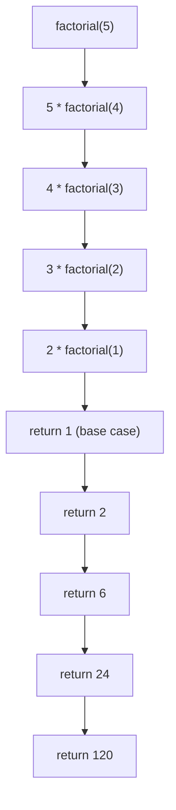

| [⬅️ 04. Approximation & Bisection Search](4.%20Approximation%20%26%20Bisection%20Search.md) | [🏠 Python Index](README.md) | [06. Tuples ➔](6.%20Tuples.md) |
---
# 📖 Module 5: Decomposition, Abstraction, and Functions

<details open>
<summary><b>📋 What You'll Learn</b></summary>

- Understand **decomposition** and **abstraction** as design principles
- Define and call **functions** with parameters, docstrings, and return values
- Distinguish between **`return`** and **`print()`**
- Work with **scope** (global vs local environments) and the **`nonlocal`** keyword
- Debug **`NoneType` errors** and **scope violations**
- Understand and write **recursive functions**
- Use **higher-order functions** and **lambda expressions**
- Create and import **Python modules**, and understand `__name__ == "__main__"`
- Apply problem-solving to a complete **Hangman Game**

</details>

---

## 🧩 Decomposition & Abstraction

### Decomposition
**Decomposition** is the process of breaking a complex problem or program into **smaller, self-contained, and reusable components (functions/modules)**.
- Simplifies complex logic into readable chunks.
- Keeps code organized and modular.

### Abstraction
**Abstraction** means hiding internal implementation details and focusing on **what a piece of code does**, rather than **how it does it**.
- You do not need to know *how* `len()` works under the hood to use it!

---

## ⚙️ Functions in Python

A **function** is a named, reusable block of code designed to perform a specific action.

### Defining and Calling a Function

```python
def greet(name):
    """Docstring: Prints a greeting message."""
    print(f"Hello, {name}!")

greet("Alice")  # Calling the function
```

### Function Anatomy
1. **`def` Keyword**: Indicates a function definition.
2. **Name**: Identifier used to call the function (`greet`).
3. **Parameters**: Input variables accepted by the function (`name`).
4. **Docstring**: Documentation describing the function's contract (optional but highly recommended).
5. **Body**: Statements executed when called.
6. **Return Value**: Value returned to the caller using `return`.

---

## 🔄 `return` vs `print()`

| Feature | `return` | `print()` |
| :--- | :--- | :--- |
| **Action** | Hands a result back to the caller & exits function | Displays text on the console |
| **Return Value** | The specified expression | Returns `None` |
| **Usage** | Used when you need to use the output in further calculations | Used to show info to the user |

```python
def add(x, y):
    return x + y

def mult(x, y):
    print(x * y)

result1 = add(2, 3)     # Returns 5 (stored in result1)
result2 = mult(3, 4)    # Prints 12, but mult() returns None
print(result2)          # Prints None
```

> [!WARNING]
> A function that does **not** contain a `return` statement implicitly returns `None`.

---

## 🐛 Progressive Debugging: Missing Returns & Scope

### 1. `TypeError: unsupported operand type(s) for +: 'NoneType' and 'int'`
This error usually happens when you try to do math on the result of a function that used `print()` instead of `return`.

```python
def double(x):
    print(x * 2) # BUG! Forgot 'return'

val = double(5)
total = val + 10 # Crash! You are trying to add None + 10.
```

### 2. `UnboundLocalError: cannot access local variable`
This occurs when you try to modify a global variable inside a local function without declaring it `global`.

```python
score = 0

def increase_score():
    score += 10 # BUG! Python thinks 'score' is a new local variable.
```
**Fix**: Avoid modifying global variables inside functions. Instead, pass the value as an argument and `return` the new value.

### 3. The `nonlocal` Keyword
For **nested functions** (a function defined inside another function), use `nonlocal` to modify a variable from the enclosing (but non-global) scope.

```python
def make_counter():
    count = 0
    def increment():
        nonlocal count  # Refers to 'count' in make_counter's scope
        count += 1
        return count
    return increment

counter = make_counter()
print(counter())  # 1
print(counter())  # 2
```

---

## 🌐 Scope & Environments

### Global Environment
- Variables defined at the top level belong to the global scope.
- They exist for the entire lifetime of the program.

### Local Environment (Function Scope)
- Created every time a function is called.
- Parameters and local variables exist **only** inside this frame.
- Frame is **destroyed** when the function finishes or returns.

```python
x = 10  # Global variable

def display():
    y = 20  # Local variable
    print(x) # Can read global x

display()
# print(y)  # Raises NameError: name 'y' is not defined
```

---

## ⚙️ Default Parameters

Default parameters allow a function to use a **default value** if an argument is not provided. 

```python
def greet(name, message="Hello"):
    print(f"{message}, {name}!")

greet("Bob")                  # Hello, Bob!
greet("Alice", "Welcome")     # Welcome, Alice!
greet(name="Eve", message="Hi") # Keyword arguments
```

> [!IMPORTANT]
> **Rule:** Default parameters must come **after** non-default parameters.
> ```python
> def greet(message="Hello", name): # ❌ SyntaxError
> ```

---

## 📦 Modules in Python

A **module** is a `.py` file containing Python statements, functions, classes, and variables meant to be reused. You can use built-in modules to expand Python's capabilities.

```python
import random
import math

# Using functions from the imported modules
print(math.sqrt(16))          # 4.0
print(random.choice("abcd"))  # Picks a random letter from the string
```

### The `if __name__ == "__main__":` Idiom
When you import a module, Python executes all the code at the top level of that file. To prevent code from running when your file is imported by another script, wrap the executable code in this `if` block:

```python
# my_module.py
def say_hello():
    print("Hello from module!")

# This code ONLY runs if you execute this file directly (e.g., python my_module.py)
# It will NOT run if someone else does: import my_module
if __name__ == "__main__":
    say_hello()
```

---

## 🔁 Recursion

A **recursive function** is a function that calls **itself** as part of its own definition. Every recursive function must have:
1. A **base case** — a condition that stops the recursion (prevents infinite loops).
2. A **recursive case** — a step that reduces the problem toward the base case.

### Classic Example: Factorial
$$n! = n \times (n-1) \times \cdots \times 1$$

```python
def factorial(n):
    """Returns n! (n factorial). Assumes n >= 0."""
    # Base case: 0! and 1! are both 1
    if n <= 1:
        return 1
    # Recursive case: n! = n * (n-1)!
    return n * factorial(n - 1)

print(factorial(5))  # 120
```

### How Recursion Works (Call Stack)


### Classic Example: Fibonacci
$$F(n) = F(n-1) + F(n-2), \quad F(0) = 0, \quad F(1) = 1$$

```python
def fib(n):
    """Returns the nth Fibonacci number. Assumes n >= 0."""
    if n <= 1:
        return n
    return fib(n - 1) + fib(n - 2)

print(fib(7))  # 13
```

> [!WARNING]
> **Without a base case**, a recursive function will call itself infinitely until Python raises a `RecursionError: maximum recursion depth exceeded`.

> [!TIP]
> Every loop can be rewritten as recursion and vice versa. Use recursion when the problem is **naturally self-similar** (trees, factorials, Fibonacci, directory traversal). Use loops when the structure is straightforwardly sequential.

---

## 🧠 Advanced: Higher-Order Functions

In Python, **functions are first-class objects**. They can be passed as arguments or returned from other functions.

### Functions as Arguments
```python
def is_even(x):
    return x % 2 == 0

def apply_to_range(func, n):
    count = 0
    for i in range(n + 1):
        if func(i):
            count += 1
    return count

print(apply_to_range(is_even, 10))  # 6 (0, 2, 4, 6, 8, 10)
```

### Lambda Functions (Anonymous Functions)
A concise, single-expression anonymous function.
**Syntax**: `lambda arguments: expression`

```python
square = lambda x: x * x
print(square(5))  # 25

# Inline lambda passed to our higher-order function:
print(apply_to_range(lambda x: x % 3 == 0, 10)) # Count multiples of 3
```

---

## 🧪 Self-Check Questions & Quizzes

### Question 1: The Missing Return Bug 🐛 (Debugging)

What happens when you run this code?
```python
def multiply(a, b):
    print(a * b)

result = multiply(4, 5) + 10
```

<details>
<summary><b>💡 Click to Reveal Solution & Explanation</b></summary>

#### ✅ Solution
It prints `20`, and then crashes with a `TypeError`.

#### 🔍 Explanation
Because `multiply` uses `print()` instead of `return`, it implicitly returns `None` to the caller. The variable `result` tries to calculate `None + 10`, which crashes Python.
**Fix:** Change `print(a * b)` to `return a * b`.
</details>

---

### Question 2: The Early Return Pattern 💼 (Interview)

What is the output?
```python
def check_status(score):
    if score > 50:
        return "Pass"
    return "Fail"

print(check_status(80))
print(check_status(30))
```

<details>
<summary><b>💡 Click to Reveal Solution & Explanation</b></summary>

#### ✅ Solution
```text
Pass
Fail
```

#### 🔍 Explanation
When a function executes a `return` statement, it **immediately exits**. 
For `80`, the `if` condition is `True`, so it returns `"Pass"` and the function ends. It never reaches the second return. This is a common pattern to avoid using `else` blocks.
</details>

---

### Question 3: Parameter Re-binding 🔥 (Tricky)

What is the output?
```python
def update_value(x):
    x = 100

a = 50
update_value(a)
print(a)
```

<details>
<summary><b>💡 Click to Reveal Solution & Explanation</b></summary>

#### ✅ Solution
```text
50
```

#### 🔍 Explanation
When `update_value(a)` is called, the local parameter `x` points to the value `50`. Inside the function, `x = 100` re-binds the **local variable `x`** to a new value (`100`). The global variable `a` is completely unaffected.
</details>

---

### Question 4: Loop Return Trap 🧠 (HOTS)

A developer wrote this function to count from 0 to 2, but it only outputs `0`. Why?
```python
def count_up():
    for i in range(3):
        return i

print(count_up())
```

<details>
<summary><b>💡 Click to Reveal Solution & Explanation</b></summary>

#### ✅ Solution
```text
0
```

#### 🔍 Explanation
A `return` statement instantly destroys the local environment and hands control back to the caller. On the very first iteration of the loop (`i = 0`), the `return` statement executes, killing the loop prematurely and returning `0`.
</details>

---

### Question 5: Recursion — Base Case Trace 🧠 (HOTS)

What does this code print? Trace the call stack manually.
```python
def mystery(n):
    if n == 0:
        return 0
    return n + mystery(n - 1)

print(mystery(4))
```

<details>
<summary><b>💡 Click to Reveal Solution & Explanation</b></summary>

#### ✅ Solution
```text
10
```

#### 🔍 Explanation
This is a recursive sum: `mystery(4)` computes `1 + 2 + 3 + 4`.

Call stack trace:
```
mystery(4) = 4 + mystery(3)
mystery(3) = 3 + mystery(2)
mystery(2) = 2 + mystery(1)
mystery(1) = 1 + mystery(0)
mystery(0) = 0            ← base case
```
Unwinding: `1 + 0 = 1` → `2 + 1 = 3` → `3 + 3 = 6` → `4 + 6 = 10`.

This is mathematically equivalent to $\sum_{i=0}^{n} i = \frac{n(n+1)}{2}$. For `n = 4`: $4 \times 5 / 2 = 10$. ✅
</details>

---

### Question 6: Missing Base Case 🐛 (Debugging)

What happens when you run this code?
```python
def countdown(n):
    print(n)
    countdown(n - 1)

countdown(3)
```

<details>
<summary><b>💡 Click to Reveal Solution & Explanation</b></summary>

#### ✅ Solution
It prints `3, 2, 1, 0, -1, -2, ...` until Python raises:
```text
RecursionError: maximum recursion depth exceeded
```

#### 🔍 Explanation
There is **no base case**. The function calls itself forever in the negative direction. Python has a default recursion limit of ~1000 calls to prevent infinite loops from crashing the process.

**Fix:** Add a base case:
```python
def countdown(n):
    if n < 0:
        return
    print(n)
    countdown(n - 1)
```
</details>

---

## 🏗️ Real-World Challenge: Hangman Game (MIT 6.100L)

### 📌 Problem Statement
You are tasked with building a text-based Hangman game. 
- The player gets **10 guesses** to discover a secret word.
- They guess one letter at a time via `input()`.
- You must show their progress (e.g., `p**h*n`).

*Notice that we haven't learned Lists yet! Can we build this entire game using just Strings, Loops, and Functions? Yes!*

### 🧠 Systematic Problem-Solving Framework

<details>
<summary><b>1. Break Down into Helper Functions (Decomposition)</b></summary>

Instead of writing a massive 100-line script, we **decompose** the game into three smaller functions:
1. `has_player_won(secret_word, letters_guessed)`: Checks if all letters in the word exist in the guessed letters string.
2. `get_word_progress(secret_word, letters_guessed)`: Returns the masked word (e.g. `a**le`).
3. `get_available_letters(letters_guessed)`: Returns the alphabet minus the guessed letters.

Once these work, we build the main `hangman(secret_word)` loop!
</details>

<details>
<summary><b>2. Implementing Helper Functions</b></summary>

```python
import string

def has_player_won(secret_word, letters_guessed):
    """Returns True if every letter in secret_word has been guessed."""
    for letter in secret_word:
        if letter not in letters_guessed:
            return False
    return True

def get_word_progress(secret_word, letters_guessed):
    """Returns progress string with guessed letters revealed and hidden letters as '*'."""
    progress = ""
    for letter in secret_word:
        if letter in letters_guessed:
            progress += letter
        else:
            progress += "*"
    return progress

def get_available_letters(letters_guessed):
    """Returns string of lowercase letters not yet guessed."""
    available = ""
    for letter in string.ascii_lowercase:
        if letter not in letters_guessed:
            available += letter
    return available
```
</details>

<details>
<summary><b>3. The Main Game Loop</b></summary>

```python
def hangman(secret_word):
    guesses = 10
    letters_guessed = ""

    print("Welcome to Hangman!")
    print(f"I am thinking of a word that is {len(secret_word)} letters long.")

    while guesses > 0:
        print("-" * 20)
        print(f"Guesses remaining: {guesses}")
        print("Available letters:", get_available_letters(letters_guessed))

        guess = input("Please guess a letter: ").lower()

        # Handle repeats
        if guess in letters_guessed:
            print("You already guessed that letter.")
            continue

        letters_guessed += guess

        # Check guess
        if guess in secret_word:
            print("Good guess:", get_word_progress(secret_word, letters_guessed))
        else:
            guesses -= 1
            print("Oops! That letter is not in my word.")
            print(get_word_progress(secret_word, letters_guessed))

        # Check win
        if has_player_won(secret_word, letters_guessed):
            print("Congratulations, you won!")
            return

    print("Sorry, you ran out of guesses. The word was:", secret_word)

# Run the game!
hangman("python")
```
</details>

---

## 🔑 Key Takeaways

| Concept | Key Point |
| :--- | :--- |
| **Abstraction** | Hide implementation details and focus on what a function does |
| **Decomposition** | Break large problems into small, self-contained functions |
| **`return` vs `print()`** | `return` passes data back. `print()` just displays it to the screen |
| **Scope** | Variables inside a function (local) are destroyed when the function ends |
| **`nonlocal`** | Used in nested functions to modify a variable from the enclosing (non-global) scope |
| **Recursion** | A function calling itself. Requires a **base case** to stop. |
| **Debugging** | `NoneType` errors usually mean you forgot to `return` a value |
| **Modules** | Use `import` to bring in external code (like `random` or `string`) |

---

| [⬅️ 04. Approximation & Bisection Search](4.%20Approximation%20%26%20Bisection%20Search.md) | [🏠 Python Index](README.md) | [06. Tuples ➔](6.%20Tuples.md) |
